# 2. Workflow nghiệp vụ (Process Flowchart)

> Đọc kèm [01-tong-quan.md](01-tong-quan.md) (thuật ngữ) và [03-sop-van-hanh.md](03-sop-van-hanh.md) (thao tác từng bước).

## 2.0. Quy ước ký hiệu

Toàn bộ sơ đồ trong tài liệu dùng ký hiệu chuẩn của lưu đồ quy trình (process flowchart):

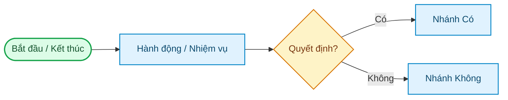

| Ký hiệu | Ý nghĩa |
|---|---|
| Hình chữ nhật **bo tròn góc** (xanh lá) | Điểm **Bắt đầu / Kết thúc** quy trình |
| Hình **chữ nhật** (xanh dương) | Một **Hành động / Nhiệm vụ** cụ thể |
| Hình **thoi** (vàng) | Điểm **Quyết định** — phân nhánh Có/Không |
| **Mũi tên →** | **Luồng** đi và hướng của quy trình |

---

## 2.1. Bức tranh tổng — hàng hóa chảy qua hệ thống

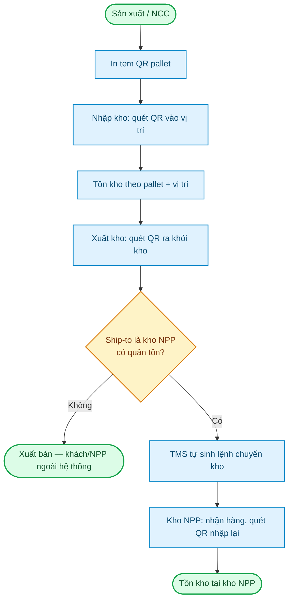

---

## 2.2. Nhập kho từ NCC (qua cổng)

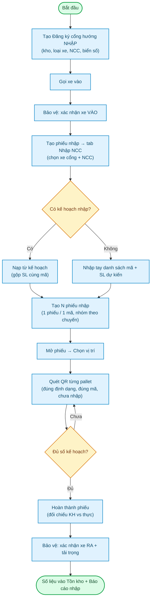

> **Ràng buộc:** 1 lượt xe = 1 nhóm phiếu cho MỖI NCC (xe ghép nhiều NCC → nhiều nhóm; trùng NCC dùng "Sửa nhóm"). Pallet đã quét ở phiếu khác sẽ bị từ chối.

---

## 2.3. Nhập kho sản xuất (SX) & hàng không QR

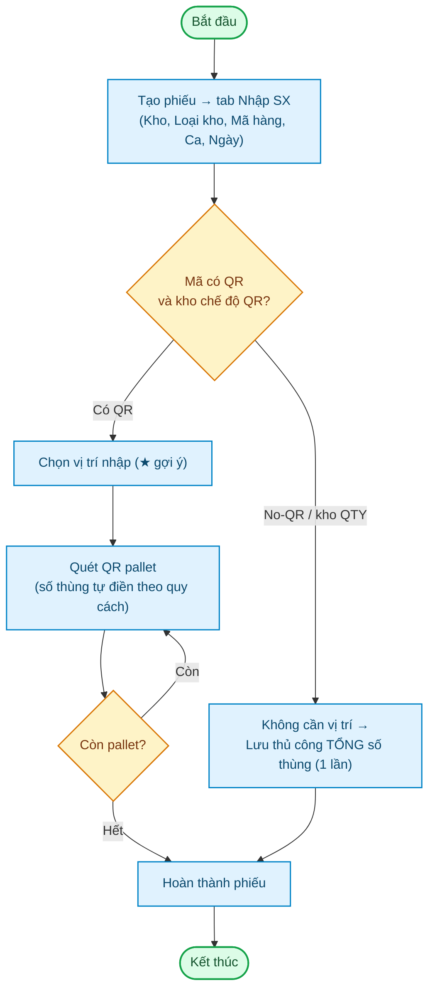

---

## 2.4. Xuất kho — vòng đời một chuyến (GDO)

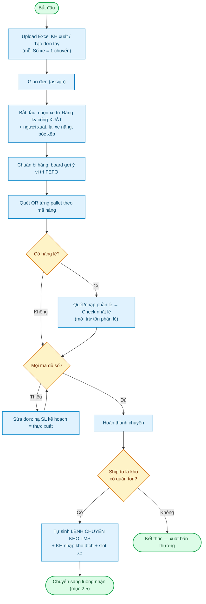

> **Bất biến:** không xuất quá tồn; không hoàn thành khi thực < kế hoạch; xuất thiếu phải hạ kế hoạch xuống bằng thực xuất. Trạng thái chuyến: Chờ (PENDING) → Giao đơn → Đang xuất (IN_PROGRESS) ↔ Tạm dừng (PAUSED) → Hoàn thành (COMPLETED).

---

## 2.5. Chuyển kho — từ kho xuất đến kho nhận

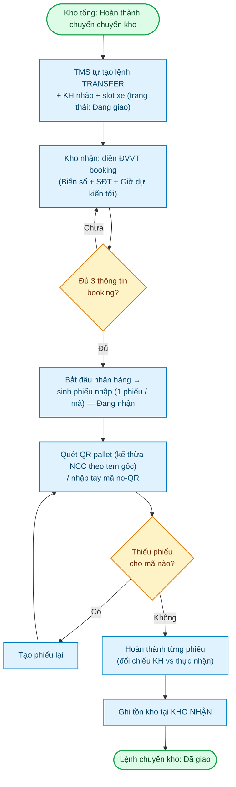

> Ở kho xuất, **"Bỏ hoàn thành" bị CHẶN** khi kho nhận đang nhận / đã nhận (bảo toàn số liệu hai đầu).

---

## 2.6. Đăng ký cổng — trạng thái lượt xe

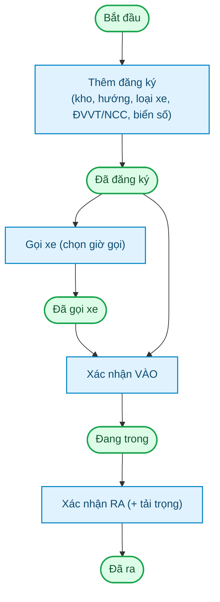

> Mỗi bước đều có nút **hoàn tác** (↺). **Xe kết hợp Nhập + Xuất:** chân Xuất chỉ được Gọi/Vào **sau khi** chân Nhập đã RA; muốn gỡ "Đã ra" chân Nhập phải hoàn tác chân Xuất trước.

---

## 2.7. Đặt khung giờ xe (TMS) — chống trùng suất

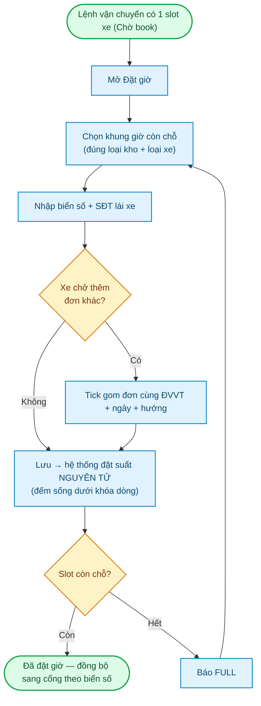

> Hủy suất: **Trả lại** (trước giờ) / **Thu hồi** (sau giờ) → nhả suất, tách nhóm gom.

---

## 2.8. Nhặt lẻ

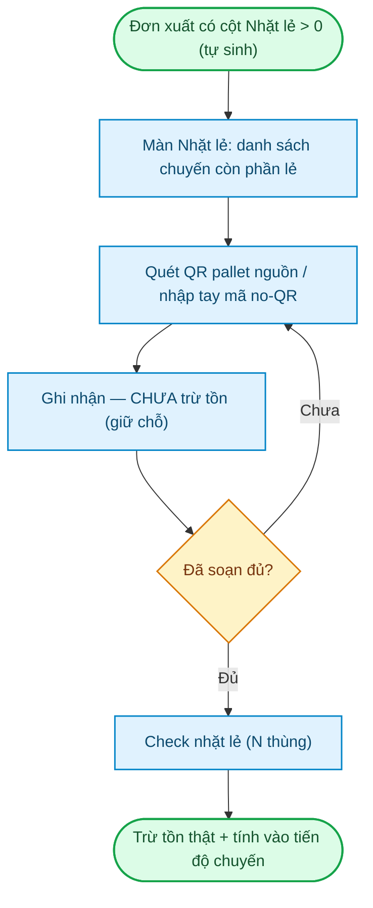

---

## 2.9. Kiểm kho (Check vị trí) & xử lý chênh lệch

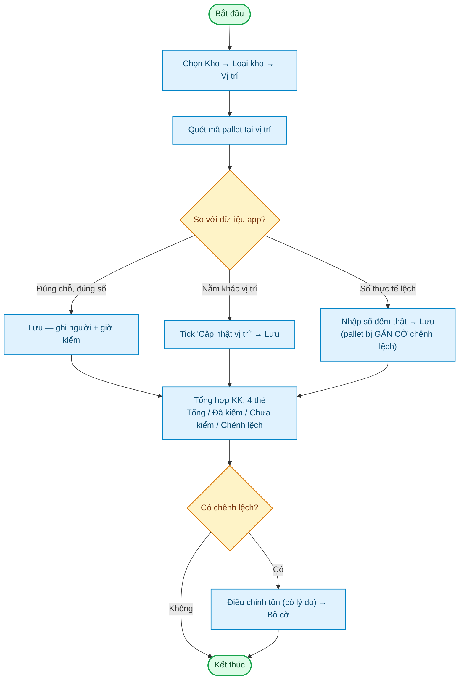

---

## 2.10. In tem / Dồn / Tách pallet

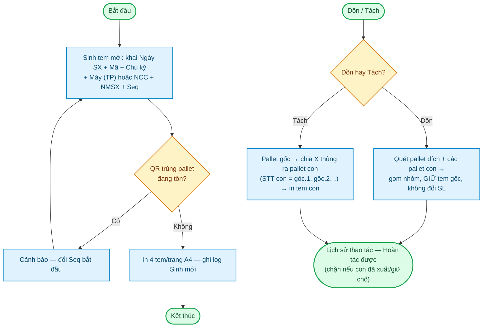

---

## 2.11. HR — Phân công lịch làm việc

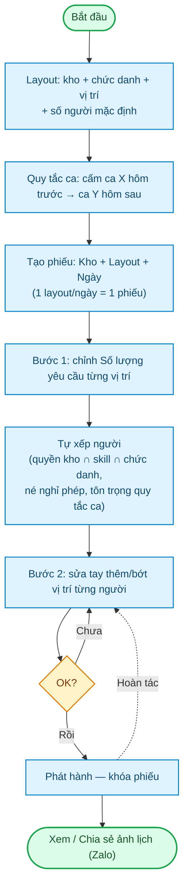

---

## 2.12. HR — Nghỉ phép & Chấm công

```mermaid
flowchart TD
    S(["Bắt đầu"]):::startend --> A["NV gửi đơn nghỉ phép\n(chặn trùng ngày)"]:::action
    A --> B{"Cấp trên duyệt?\n(theo sơ đồ chức danh + chung kho)"}:::decision
    B -->|Duyệt| C["Tự ghi chấm công 'Nghỉ phép'\ncho mọi ngày trong đơn"]:::action
    B -->|Từ chối| D(["Không ghi công"]):::startend
    C --> E(["Ngày nghỉ tự tính, không cần chấm tay"]):::startend
    C -.Xóa/đổi đơn.-> F["Tự gỡ/ghi lại công tương ứng"]:::action

    S2(["Chấm công hằng ngày"]):::startend --> G["NV tự chấm công hôm nay\n(ca + OT hoặc về sớm)"]:::action
    G --> H(["Bảng công ma trận —\nô đỏ = ngày làm việc chưa chấm"]):::startend
    classDef startend fill:#dcfce7,stroke:#16a34a,stroke-width:2px,color:#14532d
    classDef action fill:#e0f2fe,stroke:#0284c7,stroke-width:1.5px,color:#0c4a6e
    classDef decision fill:#fef3c7,stroke:#d97706,stroke-width:1.5px,color:#78350f
```

---

## 2.13. Tài khoản & quyền — từ cấp đến hiệu lực

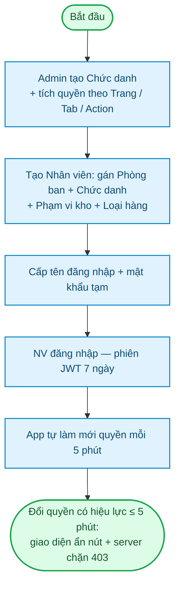
