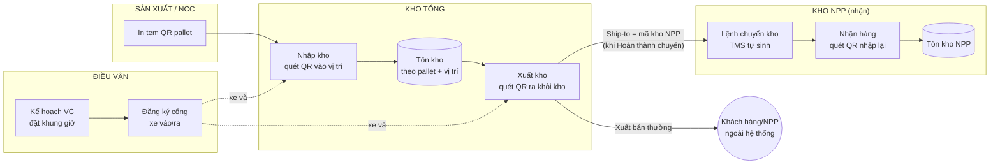
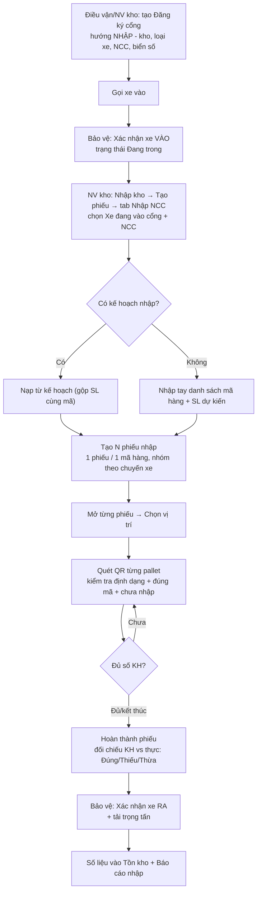
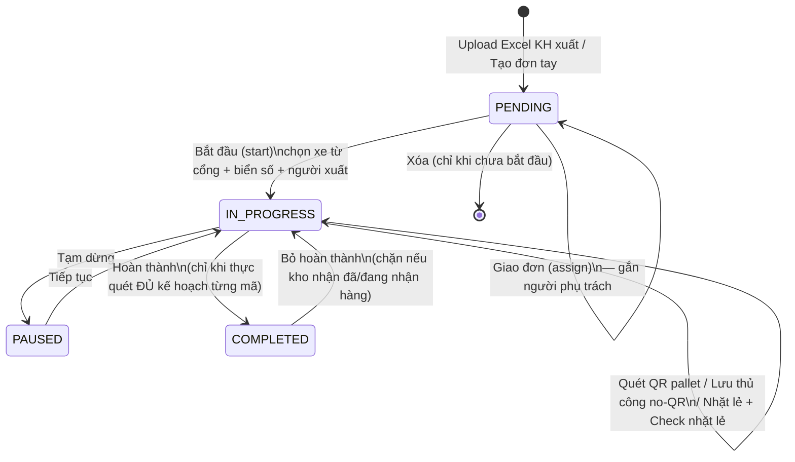
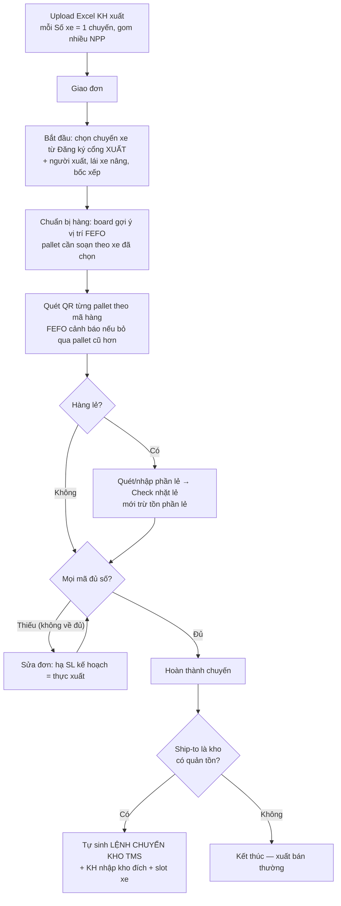
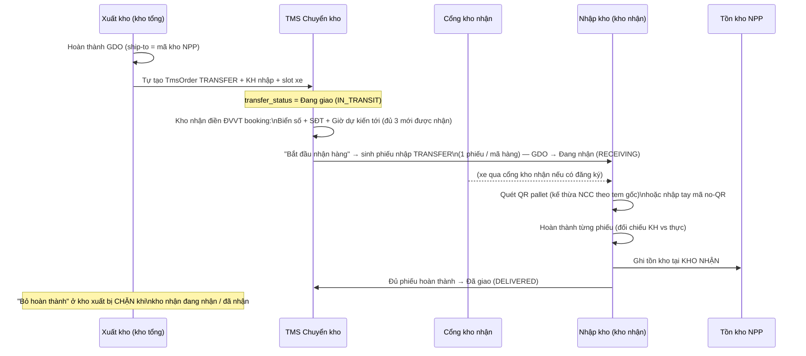
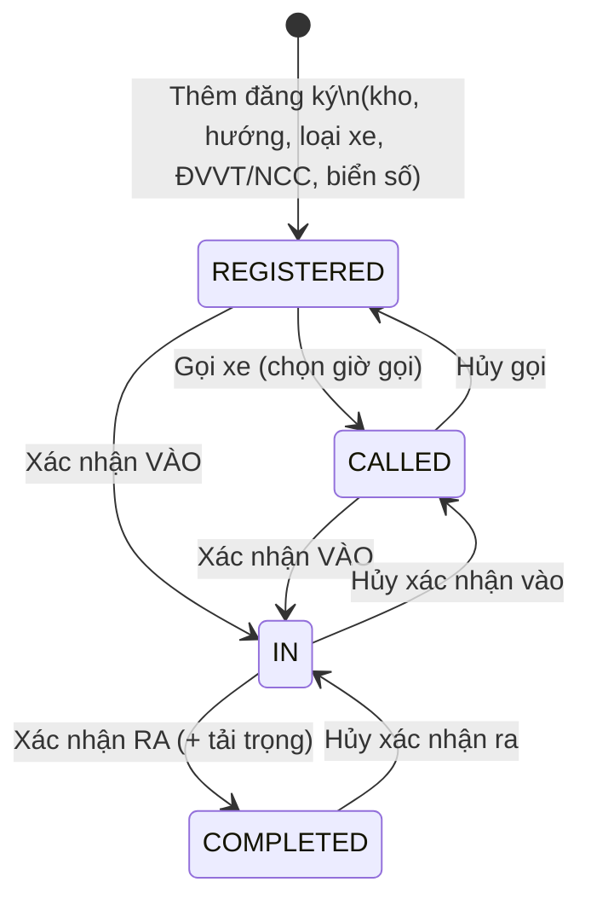
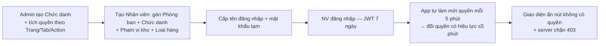

# 2. Workflow nghiệp vụ (sơ đồ Mermaid)

> Đọc kèm [01-tong-quan.md](01-tong-quan.md) (thuật ngữ) và [03-sop-van-hanh.md](03-sop-van-hanh.md) (thao tác từng bước).

## 2.1. Bức tranh tổng — hàng hóa chảy qua hệ thống



## 2.2. Nhập kho từ NCC (qua cổng)



**Ràng buộc chính:** 1 lượt xe = 1 nhóm phiếu cho MỖI NCC (xe ghép nhiều NCC → nhiều nhóm; trùng NCC phải dùng "Sửa nhóm"). Pallet đã quét ở phiếu khác sẽ bị từ chối.

## 2.3. Nhập kho sản xuất (SX) & hàng không QR

```mermaid
flowchart TD
    A[Tạo phiếu → tab Nhập SX\nKho + Loại kho + Mã hàng + Ca + Ngày] --> B{Mã có theo dõi QR?\nvà kho chế độ QR?}
    B -- "Có QR" --> C[Chọn vị trí nhập\n(gợi ý ★ vị trí còn chỗ, đang để dở cùng loại)]
    C --> D[Quét QR pallet\nsố thùng tự điền theo quy cách]
    D --> E{Tiếp?}
    E -- Còn --> D
    E -- Xong --> F[Hoàn thành phiếu]
    B -- "No-QR / kho QTY" --> G[Không cần vị trí\n→ mở phiếu → Lưu thủ công TỔNG số thùng 1 lần]
    G --> F
```

## 2.4. Xuất kho — vòng đời 1 chuyến (GDO)





**Bất biến:** không xuất quá tồn (trừ tồn nguyên tử); không hoàn thành khi thực < kế hoạch; xuất thiếu phải hạ kế hoạch xuống bằng thực xuất.

## 2.5. Chuyển kho — từ kho xuất đến kho nhận (cross-module)



## 2.6. Đăng ký cổng — trạng thái lượt xe



**Xe kết hợp (Nhập + Xuất cùng lượt):** 2 bản ghi chung nhóm; chân **Xuất chỉ được Gọi/Vào sau khi chân Nhập đã RA**; muốn gỡ "Đã ra" của chân Nhập phải hoàn tác chân Xuất trước.

## 2.7. Đặt khung giờ xe (TMS) — chống trùng suất

```mermaid
flowchart TD
    A[Lệnh vận chuyển có 1 slot xe PENDING] --> B[ĐVVT/điều vận mở Đặt giờ]
    B --> C[Chọn khung giờ còn chỗ\n(lọc đúng loại kho + loại xe, khóa slot đầy/quá giờ)]
    C --> D[Nhập biển số + SĐT lái xe]
    D --> E{Chở thêm đơn khác?\n(cùng ĐVVT + ngày + hướng)}
    E -- Có --> F[Tick gom đơn — cùng xe cùng khung giờ]
    E -- Không --> G
    F --> G[Lưu → RPC book_vehicle_slot NGUYÊN TỬ\nđếm sống dưới khóa dòng]
    G --> H{Slot còn chỗ?}
    H -- Còn --> I[BOOKED — đồng bộ sang Đăng ký cổng theo biển số]
    H -- Hết --> J[Báo FULL — chọn khung khác]
    I --> K[Trả lại (trước giờ) / Thu hồi (sau giờ)\n→ nhả suất, tách nhóm gom]
```

## 2.8. Nhặt lẻ

```mermaid
flowchart LR
    A[Đơn xuất có cột Nhặt lẻ > 0\n(tự sinh, không tạo tay)] --> B[Màn Nhặt lẻ: danh sách chuyến còn phần lẻ]
    B --> C[Quét QR pallet nguồn / nhập tay mã no-QR\n→ ghi nhận CHƯA trừ tồn (giữ chỗ)]
    C --> D["Check nhặt lẻ (N thùng)"\nxác nhận đã soạn đủ]
    D --> E[Trừ tồn thật + tính vào tiến độ chuyến]
```

## 2.9. Kiểm kho (Check vị trí) & xử lý chênh lệch

```mermaid
flowchart TD
    A[Chọn Kho → Loại kho → Vị trí\n(có cờ 🚩 vị trí phải check hằng ngày)] --> B[Quét mã pallet tại vị trí]
    B --> C{So với dữ liệu app}
    C -- "Đúng chỗ, đúng số" --> D[Lưu — ghi người + giờ kiểm]
    C -- "Pallet nằm khác vị trí" --> E[Tick 'Cập nhật vị trí' → Lưu\n(dời pallet về vị trí đang check)]
    C -- "Số thực tế lệch" --> F[Bấm 'Không khớp' → nhập số đếm thật → Lưu\n→ pallet bị GẮN CỜ chênh lệch]
    D & E & F --> G[Tổng hợp KK: 4 thẻ Tổng/Đã kiểm/Chưa kiểm/Chênh lệch]
    G --> H[Trưởng kho đối chiếu → Điều chỉnh tồn nếu cần\n→ bấm 'Bỏ cờ' đóng chênh lệch]
```

## 2.10. In tem / Dồn / Tách pallet

```mermaid
flowchart TD
    subgraph IN TEM
        A[Sinh tem mới: khai Ngày SX + Mã + Chu kỳ\n+ Máy (TP) hoặc NCC + NMSX + Seq] --> B{QR trùng pallet\nđang tồn?}
        B -- Có --> C[Cảnh báo — đổi Seq bắt đầu]
        B -- Không --> D[In 4 tem/trang A4 — ghi log Sinh mới]
        E[In lại: chọn pallet từ tồn kho/lịch sử] --> F[In — ghi log In lại\n(cảnh báo pallet đã in trước đó)]
    end
    subgraph DỒN/TÁCH
        G[Dồn: quét pallet đích + các pallet con\n→ gom nhóm, GIỮ tem gốc, không đổi số lượng]
        H[Tách: pallet gốc → chia X thùng ra pallet con\nSTT con = gốc.1, gốc.2 … → in tem con]
        G & H --> I[Lịch sử thao tác — Hoàn tác được\n(chặn nếu pallet con đã xuất/giữ chỗ)]
    end
```

## 2.11. HR — Phân công & Nghỉ phép & Chấm công

```mermaid
flowchart TD
    A[Layout: kho + chức danh + danh sách vị trí\n+ số người mặc định] --> B[Quy tắc ca: cấm ca X hôm trước → ca Y hôm sau]
    B --> C[Tạo phiếu phân công: Kho + Layout + Ngày\n(1 layout/ngày = 1 phiếu)]
    C --> D[Bước 1: chỉnh Số lượng yêu cầu từng vị trí]
    D --> E[Tự xếp người — thuật toán:\nquyền kho ∩ skill ∩ chức danh, né người nghỉ phép,\ntôn trọng quy tắc ca, cân bằng công tháng]
    E --> F[Bước 2: sửa tay thêm/bớt vị trí từng người]
    F --> G[Phát hành — khóa phiếu\n→ Xem/Chia sẻ ảnh lịch (Zalo)]
    G -.Hoàn tác.-> F
```

```mermaid
flowchart LR
    A[NV Gửi đơn nghỉ phép\n(chặn trùng ngày; cảnh báo trùng người cùng bộ phận)] --> B{Cấp trên duyệt\n(theo sơ đồ chức danh + chung kho)}
    B -- Duyệt --> C[Tự ghi chấm công 'Nghỉ phép'\ncho mọi ngày trong đơn]
    B -- Từ chối --> D[Không ghi công]
    C -.Xóa/đổi đơn.-> E[Tự gỡ/ghi lại công tương ứng]
    F[NV tự chấm công hằng ngày\n(ca + OT hoặc về sớm)] --> G[Bảng công ma trận\nô đỏ = ngày làm việc chưa chấm]
```

## 2.12. Tài khoản & quyền — từ cấp đến hiệu lực


