# 4. User Guide — Hướng dẫn từng màn hình

> Sắp xếp theo thứ tự menu. Mỗi mục: ảnh màn hình thật → bố cục → bộ lọc → bảng nút (kèm quyền) → thao tác mẫu. Quy ước giao diện chung (tìm kiếm, lọc, màu trạng thái, chọn dòng…) xem mục 1.6 của [Tổng quan](01-tong-quan.md) — không lặp lại ở đây.

## Mục lục

1. [Đăng nhập](#41-đăng-nhập) · 2. [Dashboard](#42-dashboard) · 3. [Nhập kho](#43-nhập-kho) · 4. [Xuất kho](#44-xuất-kho) · 5. [Chuẩn bị hàng](#45-chuẩn-bị-hàng) · 6. [Nhặt lẻ](#46-nhặt-lẻ) · 7. [Lịch sử quét](#47-lịch-sử-quét) · 8. [Tồn kho](#48-tồn-kho) · 9. [Check vị trí](#49-check-vị-trí-kiểm-kho) · 10. [Tổng hợp KK](#410-tổng-hợp-kk) · 11. [In tem pallet](#411-in-tem-pallet) · 12. [Dồn/Tách pallet](#412-dồn--tách-pallet) · 13. [Kế hoạch VC](#413-kế-hoạch-vận-chuyển-tms) · 14. [Báo cáo nhập](#414-báo-cáo-nhập) · 15. [Đăng ký cổng](#415-đăng-ký-cổng) · 16. [Cài đặt TMS](#416-cài-đặt-tms) · 17. [Phân công](#417-phân-công-lịch-làm-việc) · 18. [Chấm công & Nghỉ phép](#418-chấm-công--nghỉ-phép) · 19. [Sơ đồ tổ chức](#419-sơ-đồ-tổ-chức) · 20. [Mã hàng](#420-mã-hàng) · 21. [Vị trí kho](#421-vị-trí-kho) · 22. [Cài đặt WMS](#422-cài-đặt-wms) · 23. [Quản lý người dùng](#423-quản-lý-người-dùng) · 24. [Cài đặt tài khoản](#424-cài-đặt-tài-khoản) · 25. [Quét loạt (test)](#425-quét-loạt-test)

---

## 4.1. Đăng nhập

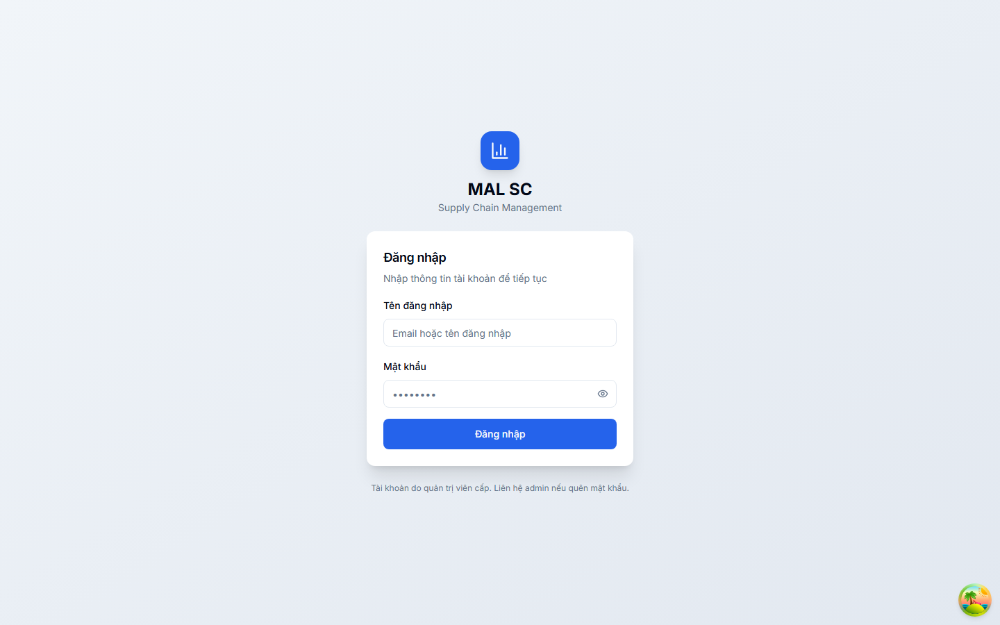

- Nhập **Tên đăng nhập** (email/username, không phân biệt hoa thường) + **Mật khẩu** (nút con mắt để hiện/ẩn) → **Đăng nhập**.
- Thông báo lỗi thường gặp: *"Tên đăng nhập hoặc mật khẩu không đúng"* · *"Tài khoản đã bị vô hiệu hóa"* · *"Tài khoản chưa được đặt mật khẩu"* (→ liên hệ admin).
- Phiên đăng nhập giữ 7 ngày; quyền tự làm mới mỗi 5 phút.

## 4.2. Dashboard

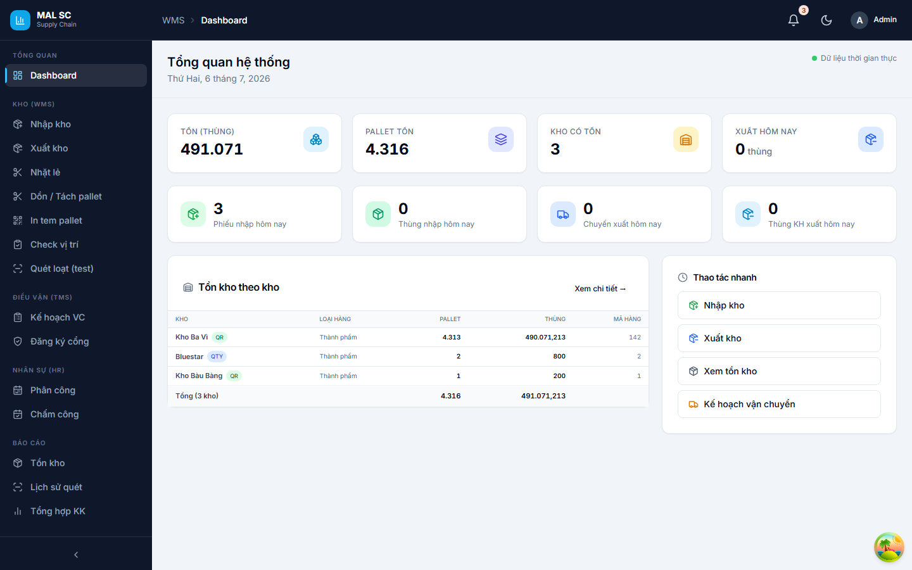

Trang chủ sau đăng nhập — dữ liệu thật, realtime, **đã cắt theo phạm vi kho + loại hàng** của bạn:

- Hàng 1 (4 thẻ KPI tồn): **Tồn (thùng)** · **Pallet tồn** · **Kho có tồn** · **Xuất hôm nay** (kèm "/N KH" nếu có kế hoạch).
- Hàng 2 (hoạt động hôm nay): Phiếu nhập · Thùng nhập · Chuyến xuất · Thùng KH xuất.
- **Bảng "Tồn kho theo kho"**: từng kho × loại hàng (Pallet / Thùng / số Mã hàng), badge chế độ quản tồn (QR/QTY/NONE), dòng tổng — nút **Xem chi tiết →** sang trang Tồn kho.
- Panel **Thao tác nhanh**: 4 lối tắt Nhập kho / Xuất kho / Tồn kho / Kế hoạch VC.

## 4.3. Nhập kho

Route `/wms/inbound` · quyền module `inbound`.

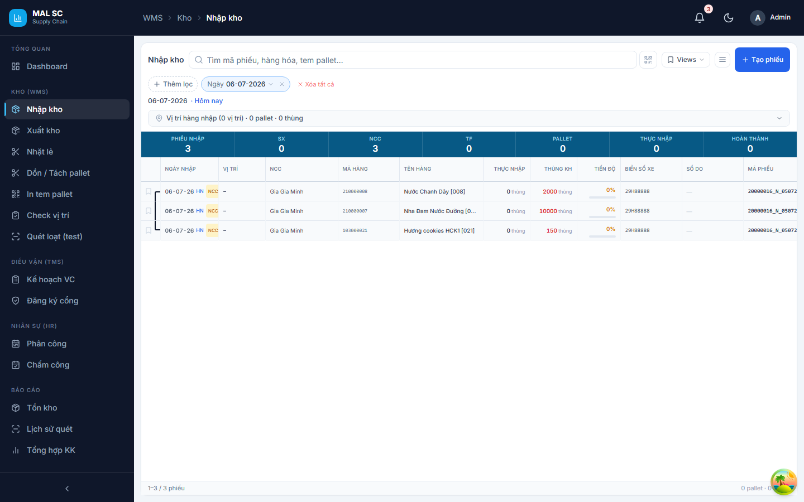

### Danh sách
- **Bộ lọc:** Ngày (Từ–Đến, nút nhanh **Hôm nay**) · Kho · Loại kho · Nguồn gốc (SX/NCC/TF) · Ca · Mã hàng · Chu kỳ · Máy · Người nhập.
- **Dải tổng:** Phiếu nhập · SX · NCC · TF · Pallet · Thực nhập · Hoàn thành.
- Khối gập **"Vị trí hàng nhập"**: tổng pallet/thùng theo vị trí thực tế — nhìn nhanh hàng đang dồn vào đâu.
- Cột chính: Ngày (badge nguồn **SX** xanh / **NCC** vàng / **TF** tím) · Vị trí (kèm nút QR quét nhanh) · NCC · Mã hàng · Thực nhập · Thùng KH (đỏ nếu thiếu) · Tiến độ % · Biển số · Mã phiếu · Pallet · Trạng thái. Các phiếu **cùng chuyến xe** được nối ngoặc bên trái.

| Nút | Quyền | Chức năng |
|---|---|---|
| **Tạo phiếu** | `inbound.create` | Mở form tạo (2 tab Nhập SX / Nhập NCC) |
| Nút **QR** trên dòng | `inbound.scan` (phiếu đang mở + có vị trí) | Quét thêm pallet ngay tại danh sách |
| **Sửa nhóm** (bút chì) | `inbound.edit` (phiếu NCC đang mở) | Sửa cả nhóm phiếu cùng chuyến: đổi SL, thêm mã, hủy dòng 0 pallet |
| Ghim (bookmark) | — | Đánh dấu "Đang làm" → thanh chuyển nhanh ở trang chi tiết |

**Form Nhập SX:** Kho → Loại kho → Mã hàng → **Vị trí** (★ = còn chỗ + đang để dở cùng loại) → Ca → Ngày. Mã không QR/kho QTY: bỏ qua vị trí, nhập số lượng ở trang chi tiết. Tùy chọn "+ Thêm NCC" để áp HSD ngoại lệ.
**Form Nhập NCC:** Kho/Loại kho → **Xe đang vào cổng** (bắt buộc — dialog chọn xe đang trong cổng; tick "Trường hợp đặc biệt" cho xe đã ra ≤3 ngày) → NCC → bảng mã hàng (nút **Nạp từ kế hoạch** gộp SL cùng mã; hỗ trợ paste Excel) → **Tạo N phiếu nhập**.

### Chi tiết phiếu

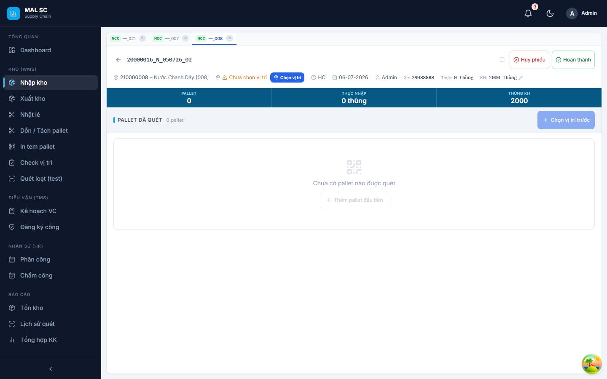

- Header: mã phiếu (màu theo trạng thái) + chips thông tin (DO, lệnh TMS, hàng, **Vị trí** + nút Đổi/Lịch sử, ca, ngày, biển số, Thực/KH — KH sửa inline với phiếu NCC).
- Bảng **Pallet đã quét**: NSX · Mã pallet · Thùng · Vị trí · Người quét · Giờ · Chu kỳ · Máy · STT.

| Nút | Quyền | Ghi chú |
|---|---|---|
| **Thêm pallet** (quét QR) | `inbound.scan` | Cần đã chọn vị trí; tự khóa khi đủ KH |
| **Lưu thủ công** | `inbound.scan` | Chỉ mã no-QR — nhập tổng thùng 1 lần |
| **Đổi vị trí** | `inbound.edit_pallet`/`force_edit_pallet` | Pallet quét sau đó vào vị trí mới |
| Sửa / Xóa pallet | `edit_pallet`·`delete_pallet` (của mình, ≤2 ngày) / `force_*` (bất kỳ) | Sửa số thùng + tầng chồng |
| **Hoàn thành** | `inbound.complete` | Dialog đối chiếu KH vs thực |
| **Gỡ hoàn thành** | `inbound.uncomplete` | Mở lại phiếu để sửa |
| **Hủy phiếu** | `inbound.cancel` | Chỉ khi 0 pallet |

**Màn quét (bảng trượt):** chọn NCC/shelf-life (hàng NCC) → ô Số thùng + Tầng chồng → camera. Quét → bíp → kiểm tra (định dạng ≥6 đoạn `_`, đúng mã hàng, chưa nhập) → **Lưu N thùng** → tự quét tiếp sau 1,5s. Phiếu chuyển kho (TF): hệ thống tra số thùng đã xuất + cảnh báo gộp tồn.

## 4.4. Xuất kho

Route `/wms/outbound` · quyền module `outbound`.

### Danh sách
- Ô tìm kiếm tra được cả **tem pallet** (dán mã QR vào để tìm chuyến chứa pallet đó).
- Khối gập **"Phân bổ theo NPP"**: Kế hoạch / Đã xuất / Còn lại theo NPP.
- **Dải tổng:** Chuyến xe · Tổng thùng · Tổng (QR) · Tổng (k QR) · Pallet · Hoàn thành.
- Cột đáng chú ý: **Ship-to** (mã gốc + badge QR/QTY nếu là kho chuyển) · **Tình trạng** (Hoàn thành xanh / Đang xuất cam / Tạm dừng đỏ / Giao đơn xanh lá) · **Chuyển kho** (Đang giao/Đang nhận/Đã giao) · các mốc Giờ giao đơn → bắt đầu → quét xong → kết thúc.

| Nút | Quyền | Chức năng |
|---|---|---|
| **Chuẩn bị hàng** | `outbound.prepare` | Mở board soạn hàng (mục 4.5) |
| **Tạo đơn** | `outbound.create` | Form tạo chuyến thủ công |
| **Upload Excel** | `outbound.import` | Nạp KH xuất (nút Tải mẫu trong dialog) |
| **Giao đơn** inline | `outbound.assign` | Ngay trên dòng chuyến chưa giao |

**Upload Excel:** mỗi *Số xe* (bắt buộc tiền tố ngày `ddmmyy_`) = 1 chuyến, gom nhiều NPP. Kết quả phân loại: Tạo mới / Cập nhật (chỉ chuyến **Tạm dừng**) / Bỏ qua (kèm lý do từng dòng — chuyến hoàn thành/đang xuất không bị ghi đè; không giảm số dưới mức đã xuất).

### Chi tiết chuyến

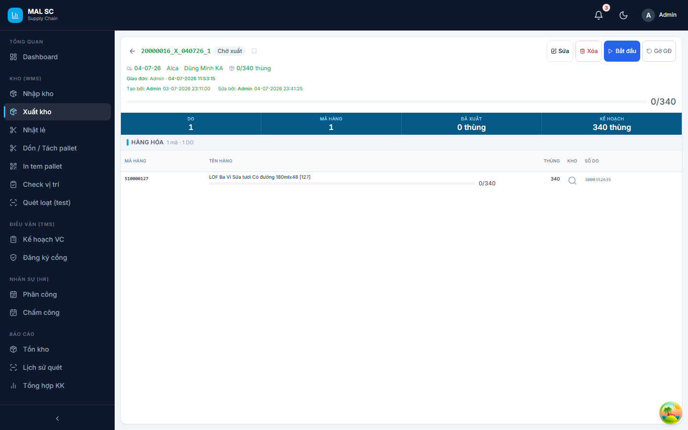

Header: trạng thái + tiến độ; card thông tin xe (biển số/cont/người xuất/bốc xếp) + **Sửa thông tin xe**; mốc thời gian; ghi chú đơn (chữ đỏ). Bảng hàng nhóm theo NPP: Mã hàng (+badge thiếu tồn "Chờ về"/"Thiếu") · tiến độ · nút **Quét** / **Lưu thủ công** / **xem tồn** từng dòng · mở rộng xem pallet đã quét.

| Nút | Quyền | Điều kiện |
|---|---|---|
| **Giao đơn / Gỡ GĐ** | `assign` / `unassign` | Trước khi bắt đầu |
| **Bắt đầu** | `start` | Chọn chuyến xe từ Đăng ký cổng XUẤT + người xuất/lái xe nâng/bốc xếp |
| **Quét** (từng mã) | `scan` | Đã bắt đầu, không Tạm dừng |
| **Lưu thủ công** | `scan` | Mã không QR — chặn vượt KH/tồn |
| **Tạm dừng / Tiếp tục** | `edit` | Đang xuất |
| **Hoàn thành** | `complete` | Mọi mã quét đủ KH |
| **Bỏ HT** | `uncomplete` | Chặn khi kho nhận đang/đã nhận |
| **Gỡ BĐ** | `unstart` | Chặn khi đã có pallet quét |
| **Sửa / Xóa** | `edit` / `cancel` | Sửa: chưa bắt đầu hoặc tạm dừng · Xóa: chưa bắt đầu |

**Màn quét mã hàng** (`?scan=1` mở camera ngay): điều kiện **Batch/%Date** in đỏ; quét → hệ thống đề xuất số thùng + cảnh báo **FEFO** nếu còn pallet cũ hơn → **Lưu N thùng** → tự quét tiếp; đủ số thì tự đóng. Panel **Tồn kho** xem nhanh %Date · Vị trí · Khả dụng. Xóa pallet quét nhầm ngay trong danh sách bên dưới.

## 4.5. Chuẩn bị hàng

Route `/wms/outbound/prepare` · quyền `outbound.prepare` (chỉ xem, không ghi).

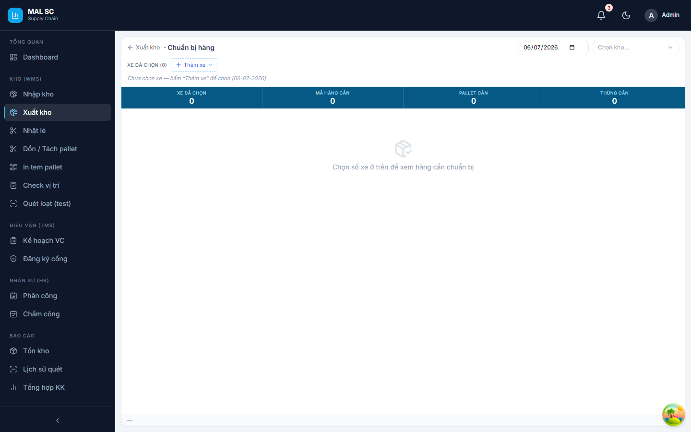

1. Chọn ngày + kho → **Thêm xe** (chuyến chưa quét xong; chuyến đã ghim tự được chọn).
2. Board tổng nhu cầu: **Vị trí (FEFO)** gợi ý 2 vị trí lấy trước · Mã hàng (+badge thiếu tồn) · Pallet cần · Còn (thùng) · **Khả dụng** (đỏ ⚠ khi thiếu, "hết tồn" khi không có).
3. Số liệu tự giảm realtime khi tổ quét làm việc. Nút kính lúp từng dòng xem tồn chi tiết theo mã.

## 4.6. Nhặt lẻ

Route `/wms/loosepicking` · quyền module `loosepicking`. Đơn nhặt lẻ **tự sinh** từ đơn xuất có cột Nhặt lẻ > 0 — không có nút tạo.

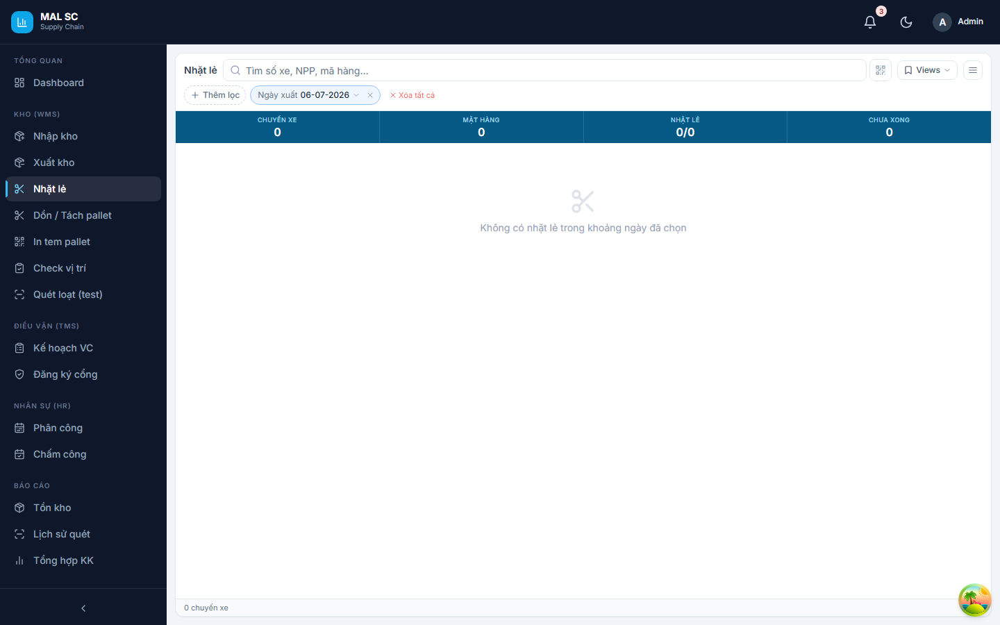
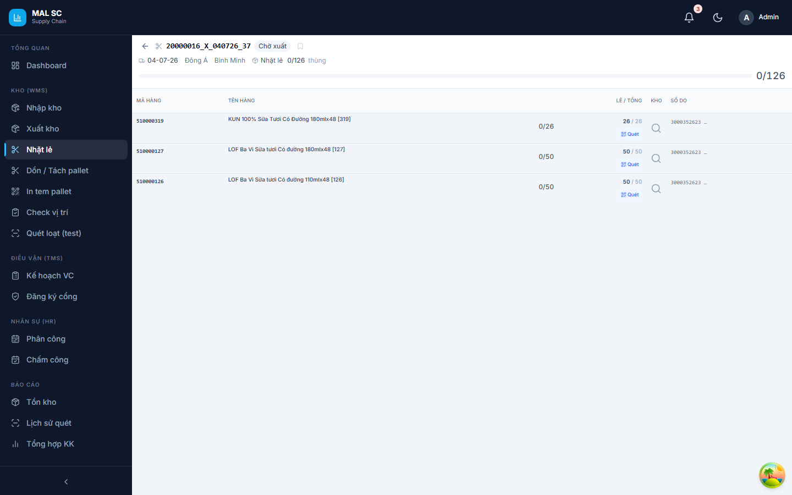

- Danh sách: theo chuyến, cột Nhặt lẻ (đã soạn/tổng), Tiến độ %, T.T. đơn, **T.T. nhặt lẻ** (Xong / Đang chuẩn bị / Chưa chuẩn bị).
- Chi tiết: chỉ các mã có phần lẻ; nút **Quét** từng mã (mirror màn quét xuất, ghi nhận **chưa trừ tồn**) → nút **Check nhặt lẻ (N thùng)** (`loosepicking.complete`) xác nhận đã soạn — lúc này mới trừ tồn.
- Mã không QR: **Lưu thủ công** số thùng lẻ (`loosepicking.scan`).

## 4.7. Lịch sử quét

Route `/wms/outbound/scan-log` · quyền `scanlog.view` (chỉ đọc).

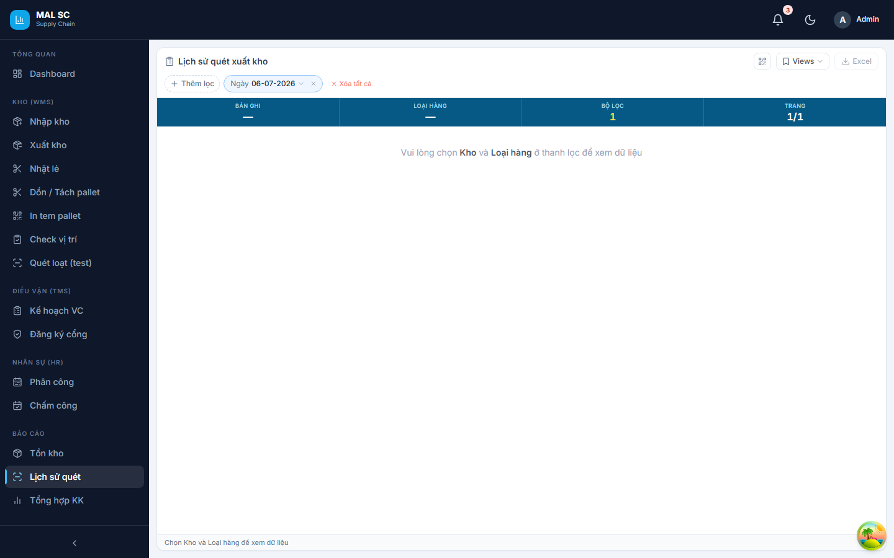

- **Bắt buộc chọn Kho + Loại hàng** mới tải dữ liệu (tránh kéo quá lớn; chặn khi >200.000 bản ghi — thu hẹp ngày).
- 12 bộ lọc: Ngày · Kho · Loại hàng · Mã/Tên hàng · Máy · Chu kỳ · NMSX · Số xe · NPP · Số DO · **Mã pallet** (có nút **Quét QR** để dán mã) · Người quét.
- Bảng 32 cột: đủ vòng đời 1 lần quét (pallet, NSX/HSD/%Date, vị trí, người quét, giờ quét, thông tin chuyến, các mốc giao/bắt đầu/quét xong/hoàn thành).
- **Excel**: xuất theo bộ lọc (tối đa 50.000 dòng/lần).

## 4.8. Tồn kho

Route `/wms/inventory` · quyền module `inventory`.

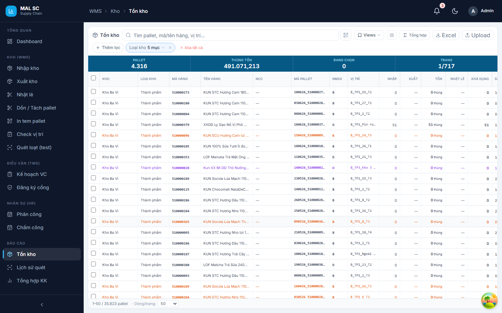

### Xem
- Bộ lọc: Kho · Loại kho · Tình trạng (mặc định **Còn tồn**) · Tên hàng · Vị trí · QA · Chu kỳ · Máy · NMSX · **%Date** (4 khoảng) · NCC.
- 2 chế độ: **chi tiết pallet** (19 cột) ↔ **Tổng hợp** (nút Σ — gom Kho × Mã × Ngày SX; click 1 dòng tổng hợp = drill-down về pallet).
- Màu chữ dòng: đỏ = pallet bị **giữ QA** · tím = %Date < 60% · cam = %Date < 80%. Badge trên mã pallet: **dồn** / **tách**.
- Click 1 dòng → **panel chi tiết** bên phải: đủ thông tin + thao tác nhanh + **Điều chỉnh tồn** + lịch sử điều chỉnh.

### Thao tác (tick pallet → thanh nổi)
| Nút | Quyền | Chức năng |
|---|---|---|
| **QA Status** | `qa_update` | Giữ/thả chất lượng hàng loạt (pallet giữ QA không xuất được) |
| **NCC** | `update_ncc` | Gán NCC + HSD ngoại lệ theo lô → %Date tính lại |
| **Vị trí** | `move_location` | Dời pallet hàng loạt (vị trí đầy bị mờ) |
| **Mã hàng** | `recode` | Đổi mã (cùng loại kho, có bước xác nhận) |
| **Ngày SX** | `update_prod_date` | Sửa ngày SX hàng loạt |
| **Tách** (tick đúng 1) / **Dồn** (tick ≥2) | `pallet_ops.split/merge` | Chuyển sang trang Dồn/Tách với dữ liệu điền sẵn |
| **Điều chỉnh tồn** (trong panel) | `adjust` | Nhập ± + lý do; ghi lịch sử |

### Upload / Export
- **Upload** (`inventory.import`): tải mẫu trong dialog. Khóa = **kho + mã pallet**: đã có → cập nhật (ghi log), chưa có → tạo mới. **File có 1 dòng lỗi = không ghi dòng nào** — sửa hết rồi up lại.
- **Excel** (`inventory.export`): xuất đúng chế độ + bộ lọc đang xem (tối đa 50.000 dòng).

## 4.9. Check vị trí (Kiểm kho)

Route `/wms/stocktake` · quyền `stocktake` (lưu = `stocktake.scan`).

1. Chọn **Kho → Loại kho → Vị trí** (🚩 = vị trí phải check hằng ngày; tick "Chỉ vị trí cần check" để lọc).
2. Quét/nhập mã pallet → thẻ kết quả: **Tồn app** + QA; so **Vị trí app** vs vị trí đang check (lệch → cảnh báo + checkbox "Cập nhật vị trí").
3. Đúng → **Lưu**. Số lệch → **Không khớp** → nhập số đếm thật → Lưu (pallet gắn **cờ chênh lệch**).
4. Lưu xong tự sẵn sàng quét pallet tiếp theo.

## 4.10. Tổng hợp KK

Route `/wms/stocktake/summary` · quyền `stocktake` ("Bỏ cờ" = `stocktake.complete`).

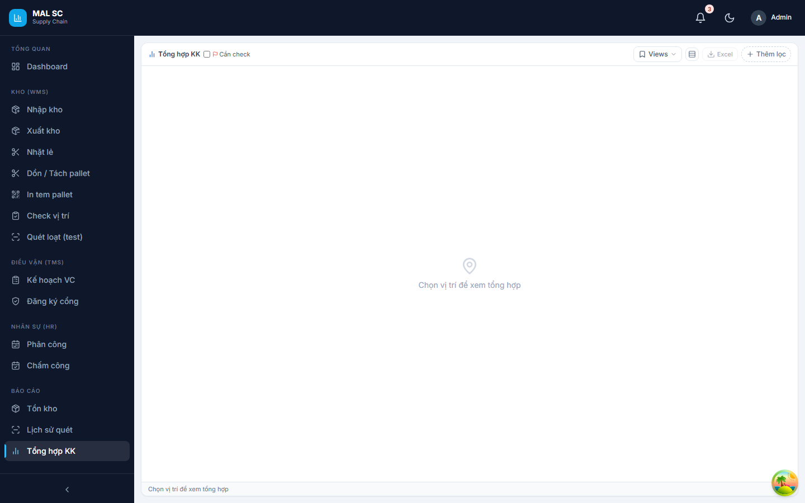

- Chọn Kho + (nhiều) Vị trí → 4 thẻ bấm-để-lọc: **Tổng pallet / Đã kiểm / Chưa kiểm / Chênh lệch**.
- Bảng: Tồn App vs Tồn thực tế + Chênh lệch (âm đỏ/dương vàng), người + giờ kiểm; dòng **chưa kiểm** xếp lên đầu.
- **Bỏ cờ**: đóng chênh lệch sau khi đã xử lý (điều chỉnh tồn ở trang Tồn kho). **Excel** xuất dữ liệu đang xem.

## 4.11. In tem pallet

Route `/wms/pallet-labels` · 4 tab = 4 quyền riêng (`generate` / `history` / `reprint` / `audit`).

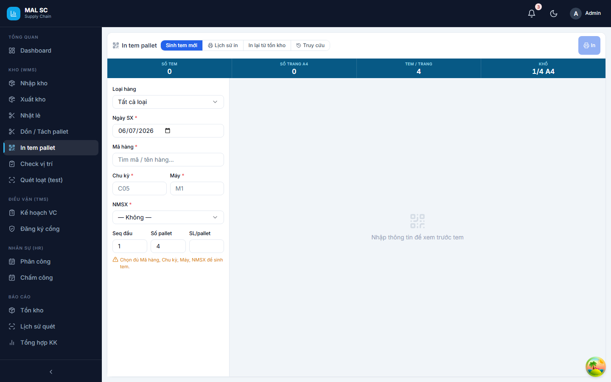

**Tab Sinh tem mới** (`generate`): khai Loại hàng · Ngày SX · Mã hàng · Chu kỳ · **Máy** (thành phẩm) hoặc **NCC** (hàng NCC) · NMSX · Seq bắt đầu · Số pallet (≤200). Preview tem phải; QR = `NgàySX_Mã_Chukỳ_Máy|NCC_Seq_NMSX`. **Cảnh báo vàng nếu QR trùng pallet đang tồn** → đổi Seq. **In (N)** → in 4 tem/trang A4, chọn **100% (Actual size)**.

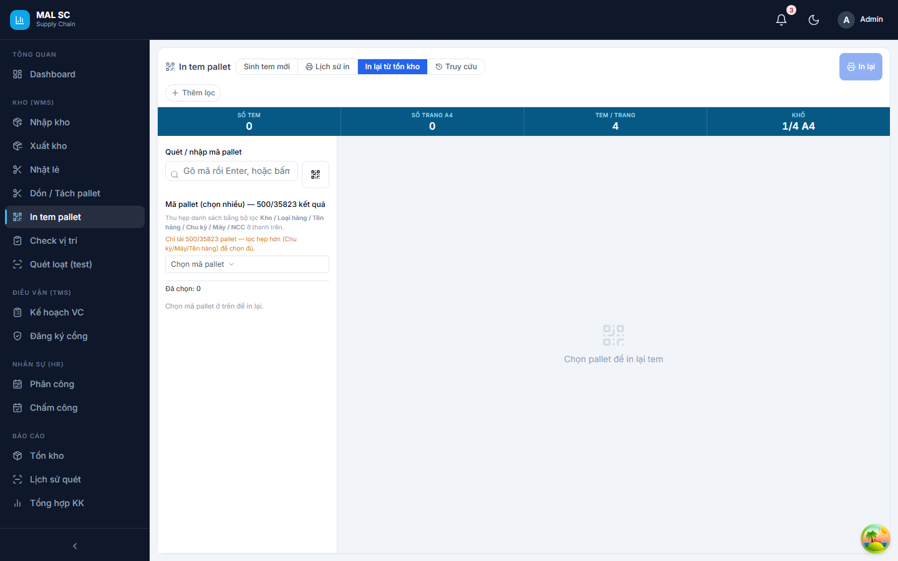

**Tab In lại** (`reprint`): quét mã pallet hoặc lọc chọn từ tồn kho; pallet từng in có badge "đã in N" + cảnh báo. **In lại (N)**.

**Tab Lịch sử** (`history`): bắt buộc nhập khoảng ngày HOẶC từ khóa (≥3 ký tự — mã pallet/mã hàng/người in). Gom theo **lệnh in**; mở rộng xem từng tem; chọn cả lệnh hoặc tick từng tem → **In lại** (cần quyền `reprint`).

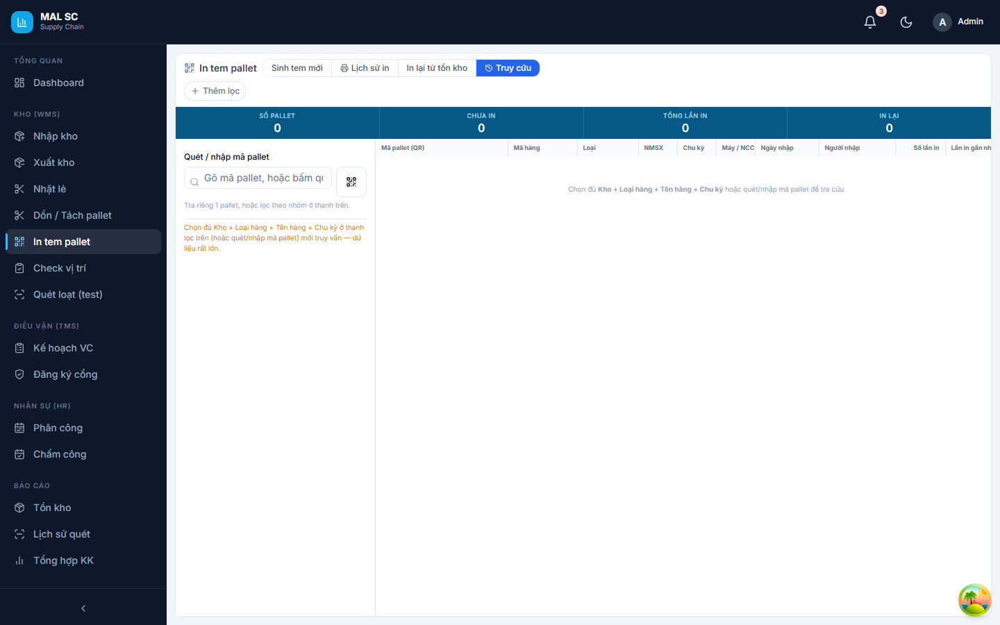

**Tab Truy cứu** (`audit`): nền tồn kho — pallet **chưa in vẫn hiện (Số lần in = 0)**; >1 lần in tô vàng. Mở rộng dòng xem lịch sử in đầy đủ (ai, lúc nào, chế độ).

## 4.12. Dồn / Tách pallet

Route `/wms/pallet-ops` · quyền module `pallet_ops`. **Bắt buộc chọn Kho + Loại kho** trước khi thao tác.

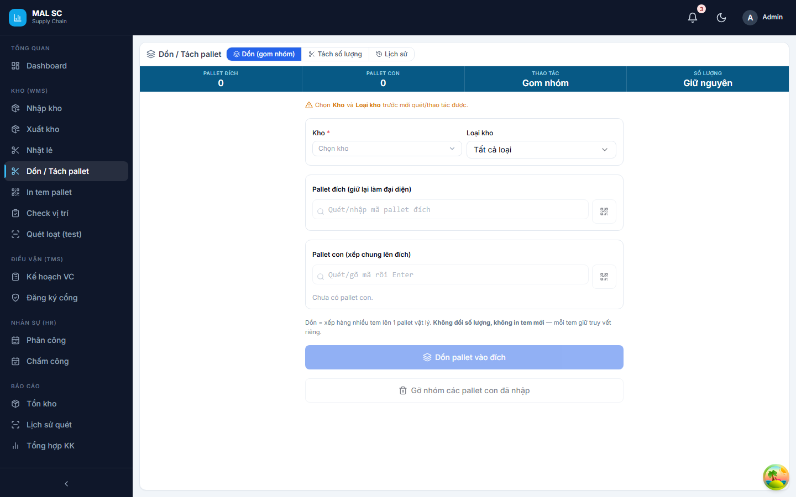

| Tab | Quyền | Thao tác |
|---|---|---|
| **Dồn (gom nhóm)** | `merge` / `ungroup` | Quét pallet **đích** + các pallet **con** → Dồn: các con gắn về đích (đổi vị trí theo đích), **giữ nguyên tem + số lượng từng pallet**. Gỡ nhóm = tách ra lại |
| **Tách số lượng** | `split` | Quét pallet gốc (hiện tồn/giữ chỗ/khả dụng) → khai số thùng từng pallet con + vị trí → **Tách** (STT con = `gốc.1`, `gốc.2`…; không tính vào báo cáo nhập) → **In tem ngay** (`pallet_print.generate`) hoặc in sau ở Lịch sử |
| **Lịch sử** | `view` | Mọi thao tác; nút **In tem** (tem con của lần tách) + **Hoàn tác** (chặn nếu pallet con đã xuất/giữ chỗ/đã dồn tiếp) |

## 4.13. Kế hoạch vận chuyển (TMS)

Route `/tms/bookings` · quyền module `tms_plan`. 2 tab: **Kế hoạch** và **Chuyển kho** (tab Chuyển kho cần `confirm_receipt`).

### Tab Kế hoạch
- Chọn **1 kho** (tài khoản ĐVVT có "Tất cả kho") → lọc Ngày · Hướng · Khung giờ · ĐVVT · Loại kho · Loại xe.
- Lưới phân trang 200/500/1000 dòng; 1 xe = 1 số thứ tự; **xe ghép nhiều đơn** và **đơn nhiều xe** hiển thị dạng cây nối (nền xanh nhạt = cụm gom).
- Cột theo dõi cổng: Tình trạng XH · Giờ ĐK · Giờ vào · Giờ ra (đồng bộ từ Đăng ký cổng theo biển số).

| Nút | Quyền | Chức năng |
|---|---|---|
| **Xem booking** | `view` | Panel lấp đầy khung giờ theo ngày (đầy = đỏ, ≥70% vàng) |
| **Upload xuất / Upload KH nhập** | `upload_outbound` / `upload_inbound` | Nạp Excel (mẫu trong dialog; chỉ dòng lỗi hiện ở preview) |
| **Thêm đơn** | `create` | Đơn Nhập có bảng danh sách hàng (paste Excel được) |
| **Đặt giờ** (xe) | `book` | Chọn khung giờ + biển số + SĐT; mục "Xe này chở thêm đơn?" để gom |
| **Thêm xe** | `add_vehicle` | Tách đơn ra nhiều xe (sau khi xe chính đã đặt giờ) |
| **Trả lại / Thu hồi** | `release` / `revoke` | Nhả suất trước giờ / sau giờ |
| **Sửa / Xóa đơn** | `edit` / `delete` | Chỉ khi mọi xe còn "Chờ book" |
| **Đổi ngày** (bulk) | `change_date` | Tick nhiều đơn chưa đặt giờ |

Trạng thái xe: **Chờ book** (vàng) → **Đã đặt giờ** (xanh lá) → Đã đến (xanh dương) → Hoàn thành (xám) / Đã hủy (đỏ). Suất khung giờ được giữ **nguyên tử** — 2 người đặt slot cuối cùng lúc, chỉ 1 người thành công, người kia nhận thông báo hết chỗ.

### Tab Chuyển kho

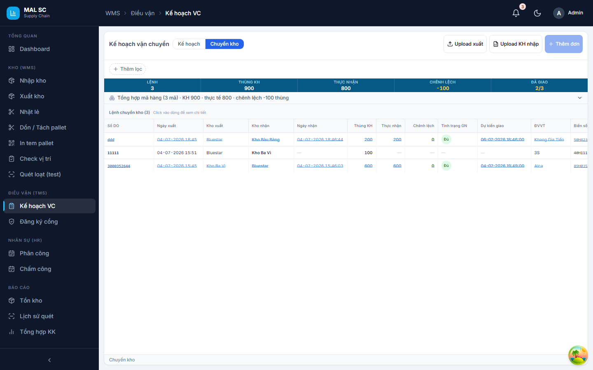

Danh sách lệnh chuyển kho (tự sinh khi kho xuất hoàn thành chuyến chuyển kho): Số DO · Kho xuất/nhận · Thùng KH · **Thực nhận** · Chênh lệch · Tình trạng GN · trạng thái (Chờ giao → **Đang vận chuyển** → **Đang nhận** → **Đã giao**).

Chi tiết lệnh — các nút (quyền `confirm_receipt` trừ khi ghi khác): **ĐVVT booking** (`edit` — Biển số + SĐT + Giờ dự kiến; *đủ 3 mới nhận được*) → **Bắt đầu nhận hàng** (sinh phiếu nhập từng mã) → **Quét** / nhập tay no-QR → **Hoàn thành** từng phiếu → lệnh Đã giao. Phụ trợ: **Tạo phiếu lại** (mã thiếu phiếu) · **Hủy nhận** (khi chưa có phiếu hoạt động) · **Mở Inbound ↗**. Nhận vượt KH chỉ cảnh báo đỏ, không chặn.

### Tab/khu Kế hoạch nhập

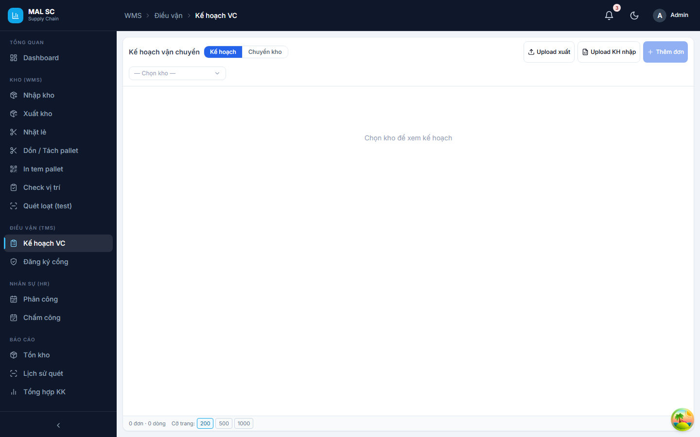

Dòng KH nhập (NCC/PO/mã hàng/số thùng) quản lý trong đơn Nhập của TMS: thêm qua **Upload KH nhập**, form thêm dòng trong chi tiết đơn, hoặc tự sinh từ chuyển kho. Đối chiếu với thực nhập ở **Báo cáo nhập**.

## 4.14. Báo cáo nhập

Route `/tms/reports` · quyền `tms_plan.view`.

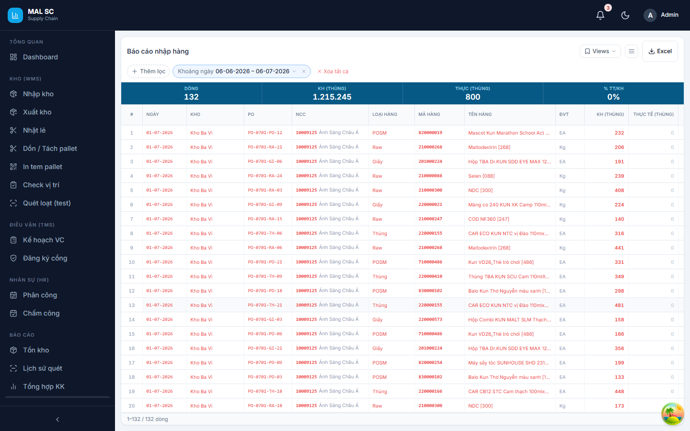

- Bắt buộc chọn **khoảng ngày**; lọc thêm Kho + Loại hàng. Dải tổng: Dòng · KH (thùng) · Thực (thùng) · %TT/KH.
- Mỗi dòng = 1 mã hàng × ngày × NCC: **PO** (bấm vào ô để sửa inline — quyền `inbound_plan.edit`) · KH · Thực tế · %.
- Màu: đỏ = có KH chưa nhập gì · cam = nhập một phần hoặc **"Phát sinh"** (nhập ngoài kế hoạch) · xanh lá = đạt 100%. **Excel** xuất theo bộ lọc.

## 4.15. Đăng ký cổng

Route `/tms/gate` · quyền module `gate_registration`.

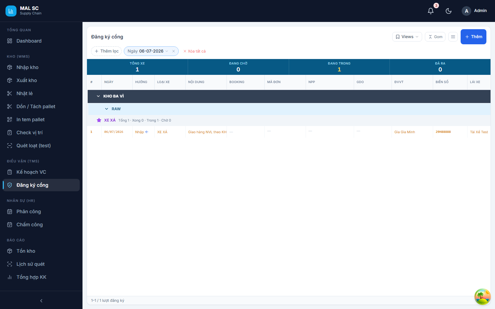

- Bảng **cây 3 cấp**: Kho → Loại kho → Loại xe (kèm thống kê Tổng · Xong · Trong · Chờ). Lọc mặc định **hôm nay**.
- Trạng thái: **Đã đăng ký** (xám) → **Đã gọi xe** (hồng) → **Đang trong** (cam) → **Đã ra** (xanh + gạch ngang). Icon Booking: `?` đỏ = trong khung giờ chưa vào · `X` đỏ = quá giờ chưa vào.

| Nút | Quyền | Chức năng |
|---|---|---|
| **Thêm / Sửa / Xóa** | `create` / `edit` / `delete` | Form 2 bước: (1) Ngày·Kho·Hướng·Loại kho·Loại xe·ĐVVT/NCC — hướng có **"Nhập + Xuất kết hợp"**; (2) Biển số·Nội dung·Lái xe·SĐT·Niêm phong·Trả pallet — booking dự kiến tự gợi ý |
| **Gọi xe** (+hoàn tác) | `call` | Chọn giờ gọi |
| **Vào** (+hoàn tác) | `entry` | Xác nhận giờ vào |
| **Ra** (+hoàn tác) | `exit` | Giờ ra + Tải trọng (tấn) |

Xe kết hợp: chân Xuất chỉ Gọi/Vào được khi chân Nhập **Đã ra**; hệ thống tự chặn thứ tự. Click dòng mở dialog chi tiết đầy đủ (SĐT bấm gọi được).

## 4.16. Cài đặt TMS

Route `/tms/settings` · 4 tab = 4 module quyền.

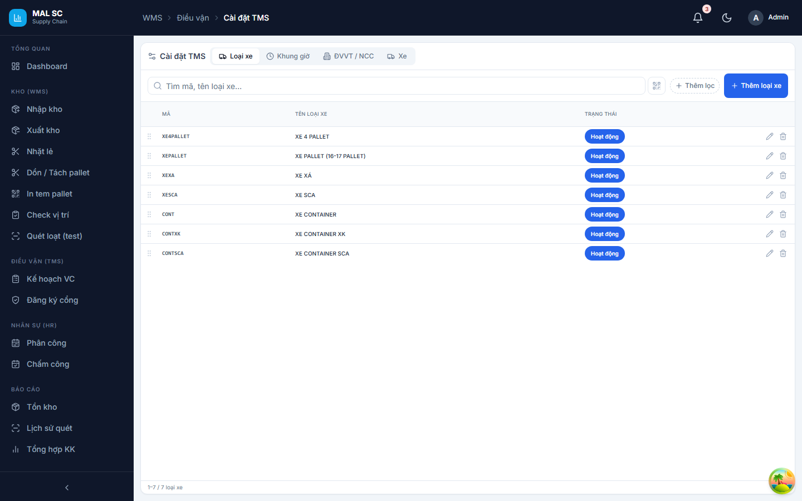

| Tab | Module | Ghi chú |
|---|---|---|
| **Loại xe** | `tms_vehicle_types` | Kéo-thả sắp thứ tự (`edit`); sửa chỉ đổi Tên + trạng thái, Mã khóa cố định |
| **Khung giờ** | `tms_slots` | Bắt buộc chọn kho. Quản theo **cụm Loại xe × Loại kho**: *Sửa cả cụm* (dialog tick Thứ + bảng giờ + Max xe; Max 0 = khóa khung) / sửa lẻ 1 dòng / xóa lẻ / xóa cụm. Thay đổi áp cho **ngày tương lai chưa có booking** — ngày còn booking giữ nguyên |
| **ĐVVT / NCC** | `tms_companies` | Loại NCC/ĐVVT; **Mã phụ** (alias ERP, cách phẩy); xóa kéo theo xe + tài khoản lái xe |
| **Xe** | `tms_vehicles` | Biển số (khóa khi sửa) gắn ĐVVT + loại xe |

## 4.17. Phân công lịch làm việc

Route `/hr/assignments` · module `work_assignment` (tab Layout = `manage_layout`, Quy tắc ca = `manage_shift_rules`).

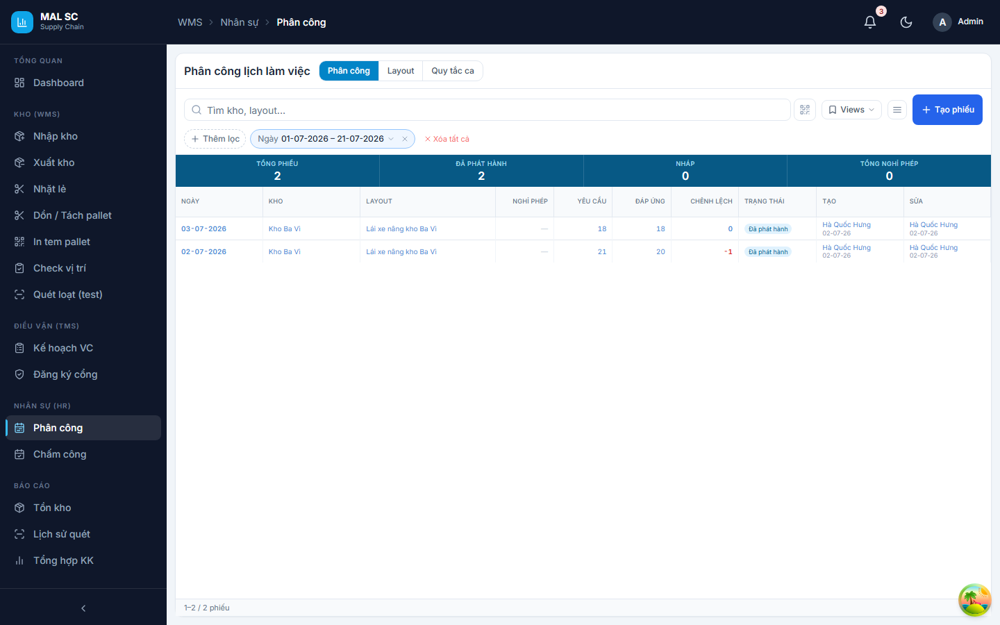

**Tab Phân công**: danh sách phiếu theo Kho/Layout/Ngày (Yêu cầu · Đáp ứng · Chênh lệch — âm đỏ; Nháp vàng / Đã phát hành xanh). **Tạo phiếu** (`create`) — mỗi (layout, ngày) 1 phiếu.

Chi tiết phiếu 2 bước:
1. **Yêu cầu nhân lực**: chỉnh Số lượng từng vị trí (−/+) → **Lưu** hoặc **Tự xếp người** (tự né người nghỉ phép đã duyệt, tôn trọng Quy tắc ca, cân bằng công tháng, ưu tiên phủ CA1+CA2 → CA3 → HC).
2. **Kết quả phân công**: bảng theo người — chips **thêm/bớt vị trí** (`edit`; 1 người nhiều vị trí được). **Phát hành** (`publish`) → khóa phiếu + **Xem lịch** (ảnh PNG bảng phân công — nút **Chia sẻ**/Tải; CA2 nền vàng, CA3 nền đỏ). **Hoàn tác** để mở khóa.

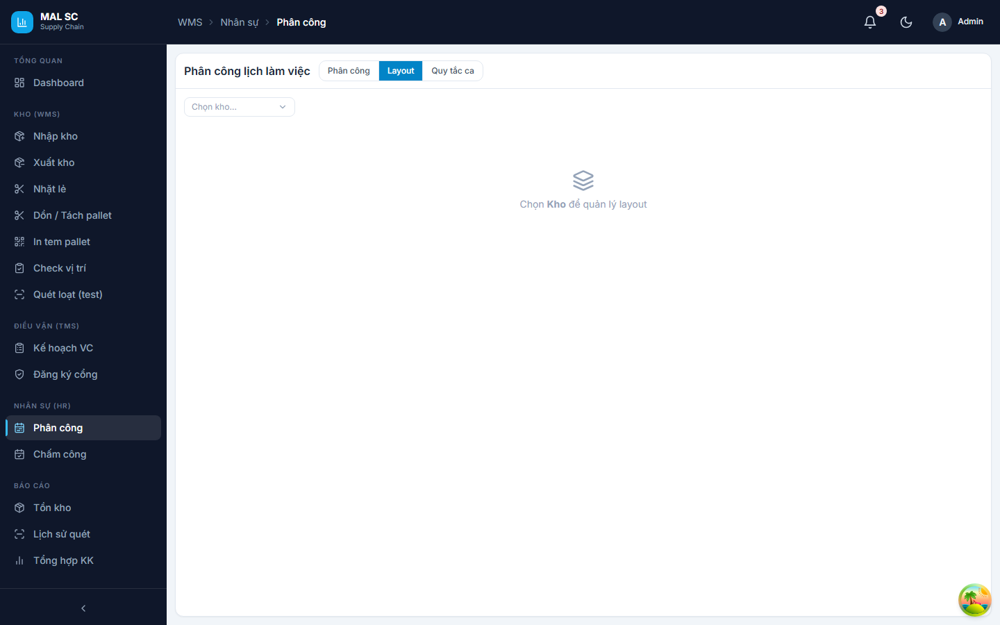

**Tab Layout**: mỗi kho nhiều layout — chọn **Chức danh** tham gia → tick **Vị trí** (danh mục skill của chức danh + cấp dưới) + số người mặc định. Layout đã dùng trong phiếu khi xóa chỉ bị ẩn.

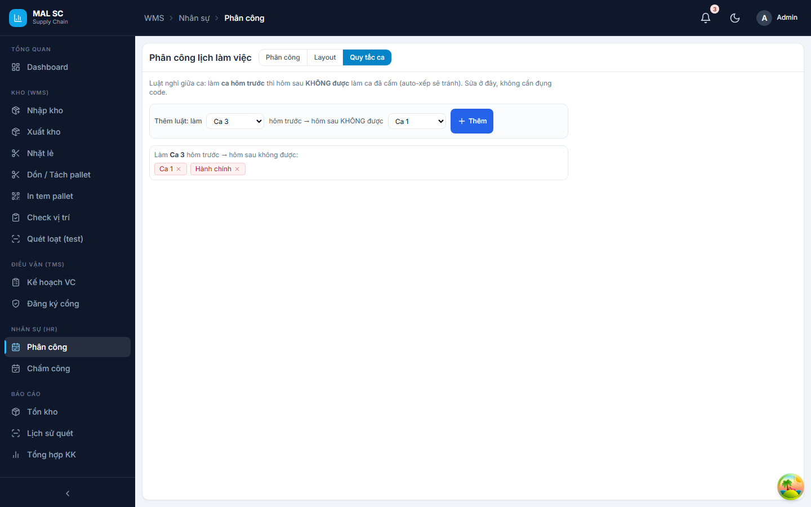

**Tab Quy tắc ca**: luật *"làm ca X hôm trước → hôm sau KHÔNG xếp ca Y"* (mặc định CA3 → CA1) — thuật toán tự xếp tôn trọng các luật này.

## 4.18. Chấm công & Nghỉ phép

Route `/hr/attendance` · 3 tab theo quyền: **Của tôi** (`attendance.self_log`) · **Nghỉ phép** (`leave`) · **Bảng công** (`attendance.view/report`). Trang Nghỉ phép độc lập: `/hr/leaves`.

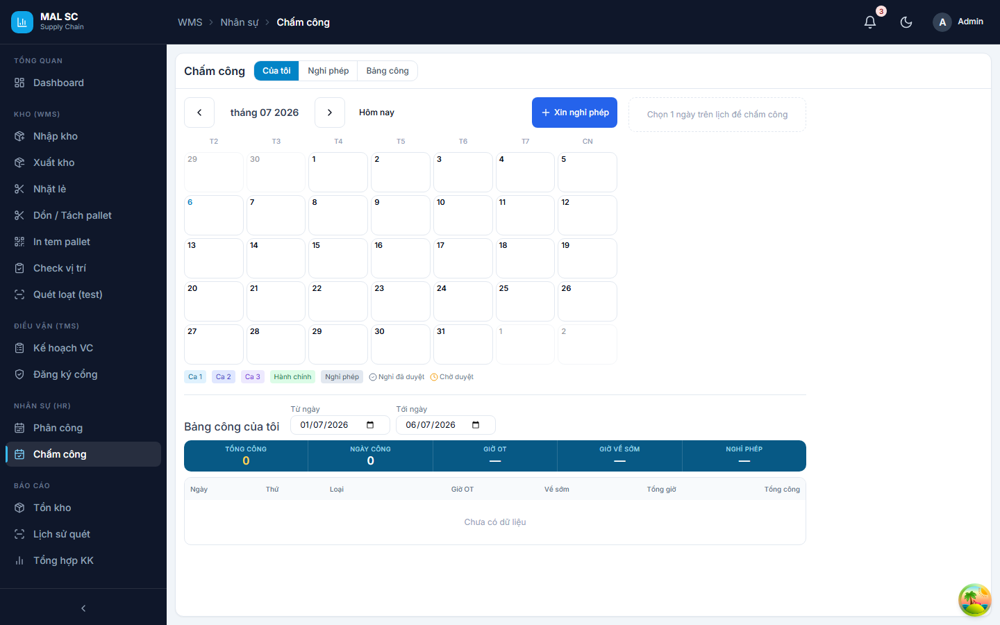

**Của tôi**: lịch tháng (cờ đỏ = ngày lễ VN; ✓ = nghỉ phép đã duyệt; đồng hồ vàng = chờ duyệt) → bấm ngày → chọn **Loại công** (Ca 1/2/3/Hành chính) + Giờ OT *hoặc* Giờ về sớm (loại trừ nhau) → **Lưu**. Chỉ tự chấm được **hôm nay** (ngày quá khứ cần quyền `attendance.edit`). Công = (8 + OT − về sớm)/8. Bên dưới: bảng công cá nhân theo khoảng ngày.

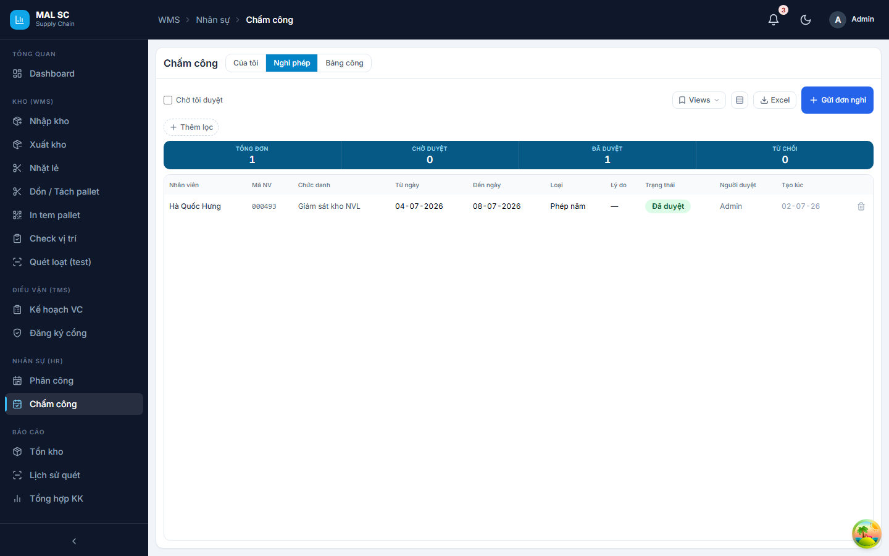

**Nghỉ phép**: **Gửi đơn nghỉ** (`request` — Từ/Đến ngày, Loại: Phép năm/Ốm/Không lương/Khác; chặn trùng ngày; cảnh báo người cùng bộ phận nghỉ trùng) → cấp trên (theo sơ đồ chức danh + chung kho) tick **"Chờ tôi duyệt"** → ✓ **Duyệt** / ✗ **Từ chối** (`approve`). Duyệt xong hệ thống **tự ghi công Nghỉ phép** các ngày trong đơn (ghi đè công cũ sẽ có cảnh báo). **Xóa** đơn (`delete`) gỡ công tương ứng.

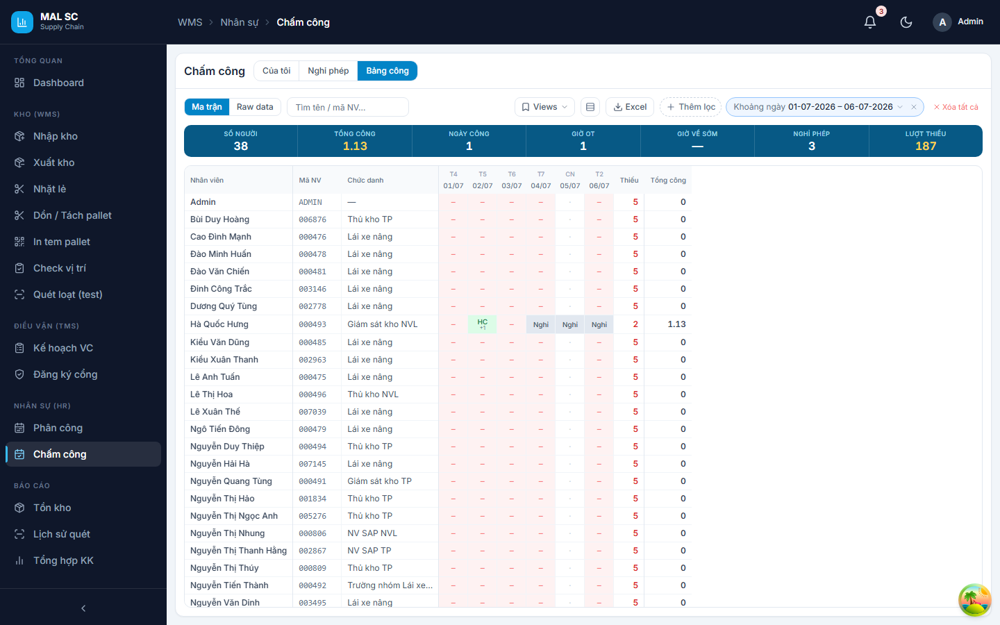

**Bảng công**: 2 chế độ **Ma trận** (dòng = người, cột = ngày; màu theo ca; **ô đỏ nhạt = ngày làm việc chưa chấm** — không tính Chủ nhật/ngày lễ) và **Raw** (từng bản ghi, xóa cần `edit`). **Excel** xuất bảng công.

## 4.19. Sơ đồ tổ chức

Route `/hr/org` · xem = `employees.view`; sửa cây = quyền quản trị (`user_admin.manage_roles`, thực tế chỉ Admin).

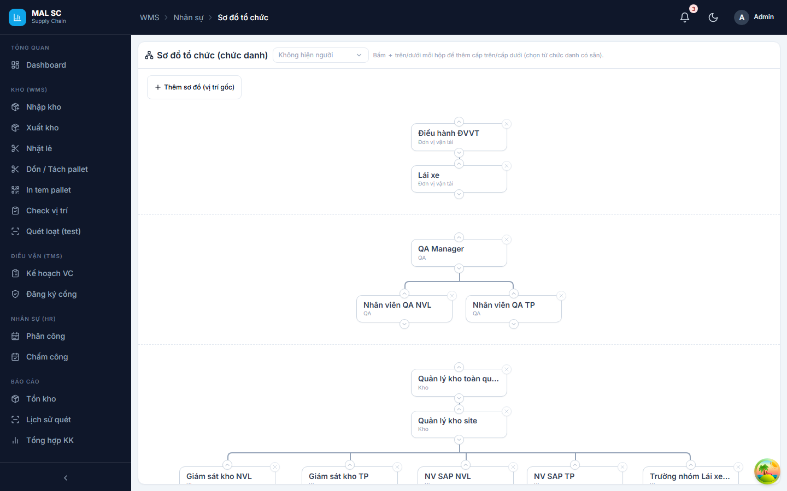

- Cây **chức danh** (không phải từng người); chọn kho ở góc phải để hiện số người của mỗi chức danh có quyền kho đó.
- Cây này quyết định: **ai duyệt nghỉ phép của ai** + **ai nhìn thấy nhân sự nào** + phạm vi sửa skill.
- Nút sửa (Admin): thêm vị trí gốc · ▲ chèn cấp trên · ▼ thêm cấp dưới (chọn nhiều) · ✗ bỏ khỏi sơ đồ (con tự nối lên cha; chức danh không bị xóa).

## 4.20. Mã hàng

Route `/masterdata/materials` · module `materials`.

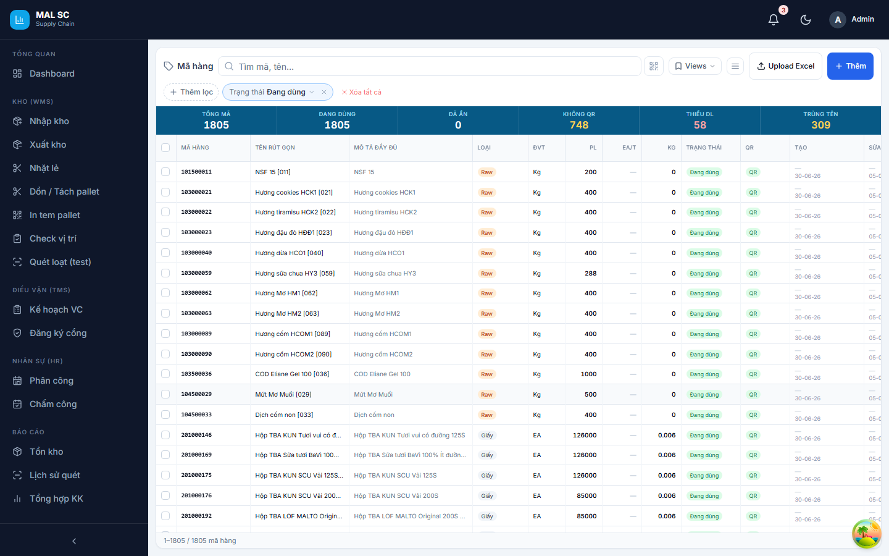

- Lọc: Loại hàng · Trạng thái · QR (Có/Không) · **Dữ liệu** (Thiếu thông tin — dòng đỏ / Trùng tên — dòng cam).
- Cột: Mã · Tên rút gọn · Mô tả · Loại · ĐVT · PL (thùng/pallet — dấu `*` = có ngoại lệ theo kho) · EA/T · KG · Trạng thái · QR · audit Tạo/Sửa.
- **Dữ liệu bắt buộc** để mã dùng được trơn tru: Loại hàng, ĐVT, Thùng/pallet; **HSD** (mọi loại trừ Thùng/POSM); **Pallet/EA** (Raw/Thùng/Giấy).

| Nút | Quyền | Ghi chú |
|---|---|---|
| **Thêm / Sửa** | `create` / `edit` | Mã khóa khi sửa. Form có: Ngoại lệ thùng/pallet theo kho · HSD theo NCC · checkbox **Quản tồn theo QR / Không QR** |
| **Upload Excel** | `import` | **Upsert**: mã mới thêm (Tên bắt buộc); mã có → chỉ cập nhật ô có giá trị, ô trống giữ nguyên. Nút Tải mẫu |
| **Ẩn** / Bulk **Ẩn tất cả** | `delete` | Ẩn mềm, khôi phục bằng cách Sửa → bật lại trạng thái |
| Bulk **Không theo dõi QR** | `edit` | Đặt hàng loạt cho mã quản theo số lượng |

Nhà sản xuất hiển thị read-only trong panel chi tiết (chưa có màn quản lý riêng).

## 4.21. Vị trí kho

Route `/wms/locations` · module `locations`.

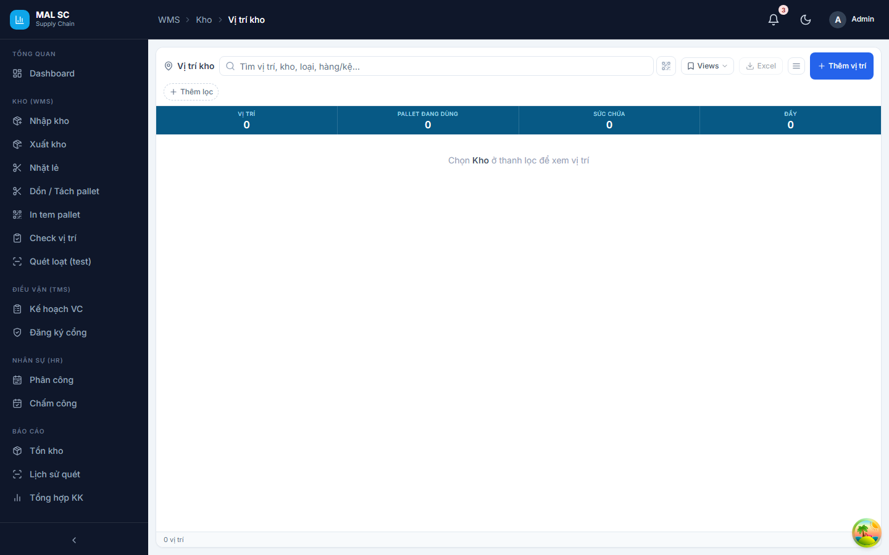

- **Phải chọn Kho** mới hiện danh sách. Lọc thêm: Loại kho · Trạng thái (tùy chọn xem "Đã xóa") · Cần check hàng ngày.
- Cột: Khu vực · **Vị trí** (mã, 🚩 = phải kiểm hằng ngày) · Sức chứa tối đa (pallet) · **Đang dùng** (used/max) · Trạng thái (Trống/Còn chỗ/**Đầy**/Đã xóa).
- **Thêm** (`create`): Kho → Khu vực → Hàng (row) → Tầng (shelf, tùy chọn) → sức chứa; **mã vị trí tự ghép** `TiềnTốKho_Khu_Hàng_Tầng` (preview trong form). **Sửa** (`edit`): đổi tên khu/loại/sức chứa/trạng thái/cờ kiểm kê (mã không đổi). **Xóa** (`delete`): chặn khi còn hàng. **Excel** xuất danh mục.

## 4.22. Cài đặt WMS

Route `/wms/settings` · mỗi tab 1 quyền: Kho `manage_warehouse` · Loại kho `manage_type` · Khu vực `manage_zone` · Ca nhập `manage_shift` · QA `manage_qa`.

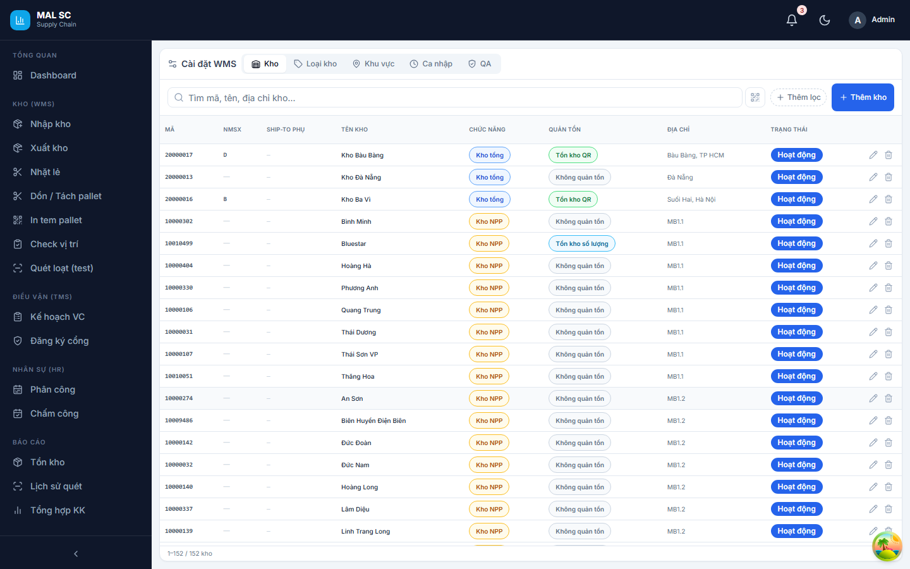

- **Kho**: Mã (khóa khi sửa) · Tên · Chức năng (**Kho tổng/Kho NPP**) · **Chế độ quản tồn** (QR = quét pallet / QTY = số lượng / NONE = không quản) · **Ship-to phụ** (nhiều mã ERP trỏ về 1 kho — chuyển kho theo các mã này tự nhận về đây) · **Mã NMSX** (đoạn 6 của QR + tiền tố mã vị trí). Chỉ xóa được kho chưa có vị trí.
- **Loại kho**: taxonomy loại hàng; **kéo-thả thứ tự** (áp cho cây Đăng ký cổng).
- **Khu vực**: theo kho; mã tự sinh Z01/Z02 nếu bỏ trống (là phần giữa của mã vị trí — không đổi được sau tạo).
- **Ca nhập / QA**: mã + tên + thứ tự hiển thị + trạng thái.

## 4.23. Quản lý người dùng

Route `/masterdata/users` · module `user_admin` (+`work_skill`). 3 tab: **Nhân viên / Phòng ban / Chức danh**.

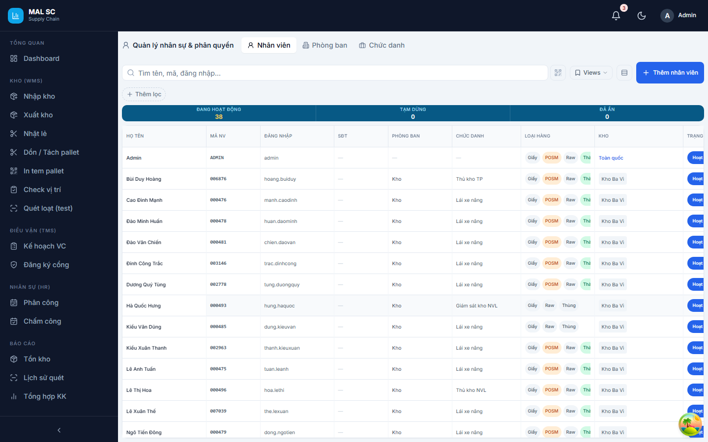

**Tab Nhân viên** — cột: Họ tên · Mã NV · Đăng nhập · SĐT · Phòng ban · Chức danh · **Loại hàng** · **Kho** (Toàn quốc/danh sách/Chưa gán) · Trạng thái.

| Nút | Quyền | Ghi chú |
|---|---|---|
| **Thêm nhân viên** | `create` | Chọn Phòng ban → Chức danh trước; gán **Loại hàng được phép** + **Phạm vi kho**; xong hiện **mật khẩu tạm** (copy) |
| **Sửa** | `edit` | Hồ sơ đầy đủ = chỉ Admin; người khác chỉ sửa được phần Kỹ năng/Vị trí |
| **Đặt mật khẩu** | `set_password` | ≥6 ký tự |
| **Xóa / Khôi phục** | `delete` | Có lịch sử → ẩn mềm; không tự xóa chính mình |

*Lái xe thuộc ĐVVT:* chọn Công ty vận tải + **Biển số xe** — biển số chính là mã đăng nhập; đổi biển quản lý ở Cài đặt TMS.

**Tab Phòng ban** (chỉ Admin): Tên + Mã + trạng thái.

**Tab Chức danh**: Admin sửa Tên/Phòng ban/**Phân quyền** (bảng tích theo Trang → Tab → Action, nút "Tất cả" từng trang) + trạng thái. Người quản lý (không phải Admin) chỉ chỉnh **danh mục Vị trí/Skill của chức danh cấp dưới mình**. Bảo vệ: không ai ngoài Admin đụng được tài khoản Admin; không cấp được quyền mình không có.

## 4.24. Cài đặt tài khoản

Route `/settings` — vào từ menu avatar góc phải trên.

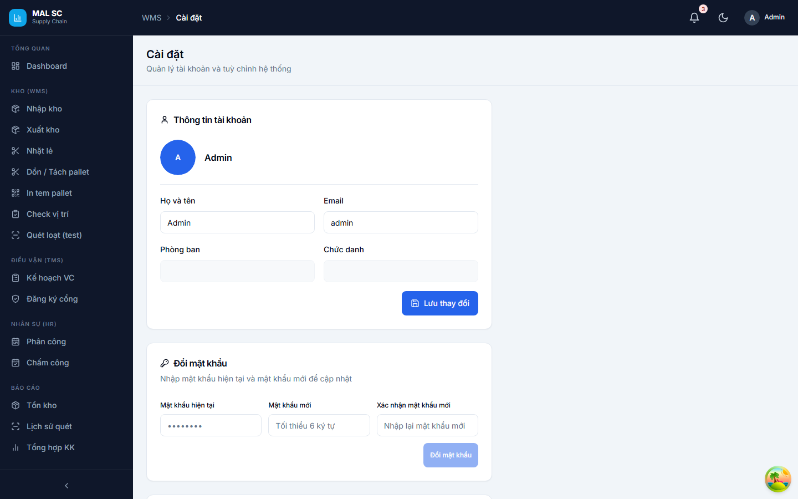

- **Đổi mật khẩu**: mật khẩu hiện tại + mới (≥6) + xác nhận — chức năng chính của trang.
- **Giao diện**: Sáng / Tối / Theo hệ thống.
- Thẻ Thông tin tài khoản, các công tắc Thông báo, nút "Đăng xuất tất cả thiết bị" hiện là **giao diện chờ** (xem 1.9).

## 4.25. Quét loạt (test)

Route `/wms/multi-scan` — chỉ Admin thấy trên menu. Trang **thử nghiệm** quét nhiều QR đồng thời trong 1 khung hình (đo tốc độ, chọn engine/độ phân giải); **không ghi bất kỳ dữ liệu nào vào hệ thống** — kết quả phiên lưu tại máy (nút JSON để copy gửi phân tích).

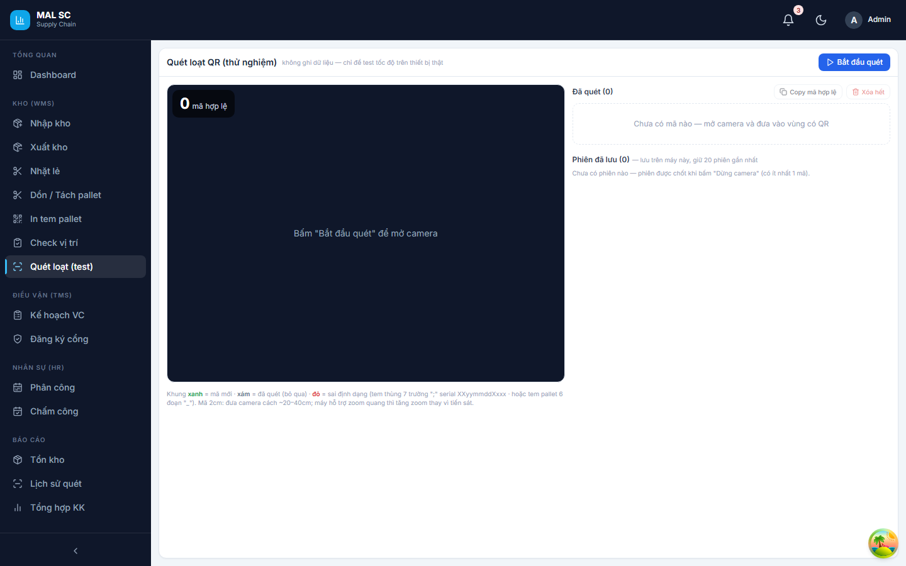
